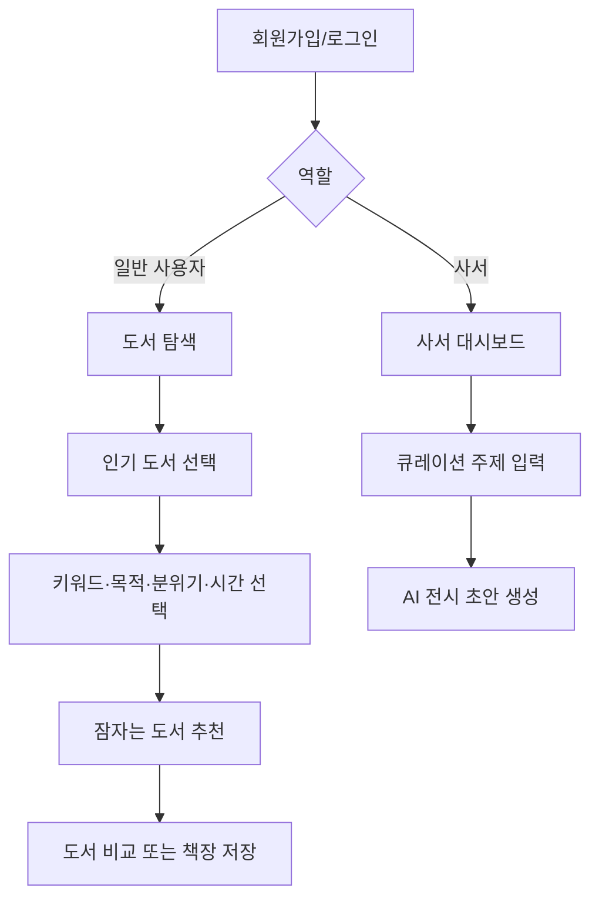
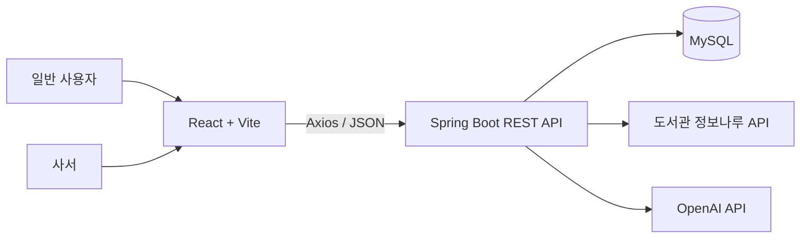

# 📚 WakeBook

> **인기 책에서 시작해, 잠자는 책을 깨우다.**

WakeBook은 인기 도서의 핵심 키워드를 출발점으로, 아직 충분히 발견되지 못한 도서를 연결하는 AI 기반 도서 탐색·큐레이션 서비스입니다. 일반 사용자는 관심사와 독서 상황에 맞는 다음 책을 찾고, 사서는 저이용 도서를 활용한 전시형 북큐레이션을 만들 수 있습니다.

## 1. 프로젝트 소개

### 1.1 개발 배경 및 필요성

도서관에는 양질의 도서가 많지만 대출은 베스트셀러와 신간에 집중됩니다. 이 때문에 주제 관련성과 정보 품질이 높아도 이용률이 낮아 독자와 만나지 못하는 ‘잠자는 도서’가 생깁니다.

기존 개인화 추천은 사용자의 이력과 비슷한 도서를 반복 제안하기 쉽습니다. WakeBook은 지금 사랑받는 책을 탐색의 입구로 삼고, 사용자가 고른 키워드·독서 목적·분위기를 기반으로 새로운 책을 발견하도록 돕습니다.

### 1.2 개발 목표

- 인기 도서에서 AI 핵심 키워드를 추출해 탐색 진입 장벽을 낮춥니다.
- 관련성은 높고 이용률은 낮은 잠자는 도서를 추천합니다.
- 추천 적합도와 AI 추천 이유를 제공해 추천 근거를 설명합니다.
- 인기 도서와 추천 도서를 비교해 사용자가 선택할 수 있게 합니다.
- 사서가 전시 주제에 맞는 저이용 도서와 소개 문구를 쉽게 만들도록 지원합니다.

### 1.3 서비스 대상

| 대상 | 제공 기능 |
|---|---|
| 일반 사용자 | 인기 도서 탐색, 키워드 기반 추천, 오늘의 책, 우연히 발견하기, 나의 책장 |
| 사서 | 일반 사용자 기능, 사서 대시보드, AI 큐레이션 초안 생성 및 관리 |

회원가입 시 역할을 선택합니다. 일반 사용자에게는 사서 공간 메뉴가 표시되지 않으며, 사서 계정에만 큐레이션 도구와 대시보드가 제공됩니다.

## 2. 주요 기능

### 2.1 인기 도서 기반 탐색

월간 인기 도서를 기준 도서로 선택하면 AI가 핵심 키워드를 제안합니다. 사용자는 관심 키워드를 선택하고 탐색을 시작합니다.

### 2.2 통합 추천

사용자는 아래 조건을 선택합니다.

- 관심 키워드
- 독서 목적: 마음의 위로, 새로운 관점, 실용적인 해결책, 깊이 있는 사유
- 원하는 분위기: 따뜻한, 담백한, 유쾌한, 사색적인

추천 결과에는 추천 적합도, 키워드 관련성, 발견 가치, AI 추천 이유를 표시합니다.

```text
최종 추천 점수 =
키워드 관련성 × 0.45
+ 독서 목적 일치도 × 0.20
+ 분위기 일치도 × 0.15
+ 도서 정보 품질 × 0.10
+ 잠자는 도서 발견 가치 × 0.10
```

### 2.3 도서 비교

기준 인기 도서와 잠자는 도서의 공통 키워드, 난이도, 문체와 추천 시점을 비교합니다. AI가 두 책의 공통점과 차이점을 자연어로 설명합니다.

### 2.4 오늘의 잠자는 책·우연히 발견하기

매일 한 권의 잠자는 도서를 소개하며, 우연히 발견하기 기능으로 예상 밖의 좋은 책을 만날 수 있습니다.

### 2.5 나의 책장

도서를 다음 상태로 관리합니다.

- 읽고 싶은 책
- 읽는 중
- 다 읽은 책
- 나중에 다시 볼 책

사용자 컬렉션을 만들고, 도서별 읽기 상태를 변경하거나 삭제할 수 있습니다.

### 2.6 사서 전용 큐레이션

사서는 전시 주제, 대상 연령, 분위기 등을 입력해 잠자는 도서 후보와 전시 제목·소개 문구·해시태그의 AI 초안을 생성할 수 있습니다.

### 2.7 일 단위 실시간 트렌드 추천

매일 Google Trends KR에서 급상승 후보를 발견하고 NAVER 뉴스와 검색 추이로 국내 맥락을 보강·검증합니다. OpenAI는 원문 검색어를 그대로 노출하지 않고 기사 근거에서 화면용 주제, 맥락 설명, 도서 검색 의도와 필수 개념 묶음을 생성합니다. 이후 도서관별 잠자는 도서 후보군과 관계를 보존한 채 매칭해 최대 5개 주제를 제공합니다.

홈과 헤더의 `실시간 트렌드` 메뉴에서 `/trends` 화면으로 이동합니다. 일반 조회는 저장된 결과만 읽으므로 사용자의 GET 요청마다 외부 API나 OpenAI를 다시 호출하지 않습니다.

### 2.8 공개 사서 큐레이션

사서가 `isPublic=true`로 저장한 큐레이션은 로그인하지 않은 이용자도 `/curations`에서 최신순으로 볼 수 있습니다. 목록은 제목·설명·대표 표지·도서 수를 보여주고, 상세 화면은 포함 도서와 사서 코멘트를 제공합니다. 비공개 큐레이션은 목록에서 제외하며 직접 ID를 요청해도 `404`로 처리합니다.

새 큐레이션에서 `isPublic`을 생략하면 비공개로 저장하고, 수정 요청에서 생략하면 기존 공개 상태를 유지합니다.

## 3. 화면 및 사용자 흐름



## 4. 시스템 구성



## 5. 기술 스택

| 구분 | 기술 | 용도 |
|---|---|---|
| Frontend | React, Vite | 화면 및 개발 환경 |
| Frontend | React Router | 페이지 라우팅 |
| Frontend | Axios | REST API 통신 |
| Frontend | CSS, Lucide React | 반응형 UI 및 아이콘 |
| Backend | Spring Boot, Java | REST API 및 비즈니스 로직 |
| Database | MySQL | 회원, 도서, 추천, 큐레이션 데이터 |
| AI | OpenAI API | 키워드·추천 이유·전시 문구 생성 |
| Public API | 도서관 정보나루 API | 인기 도서 및 도서 정보 |

## 6. 프론트엔드 구조

```text
.
├── frontend/
│   ├── public/
│   ├── src/
│   │   ├── api/
│   │   │   └── client.js    # Axios 인스턴스 및 API 함수
│   │   ├── data/
│   │   │   └── books.js     # 개발용 샘플 데이터
│   │   ├── App.jsx          # 라우팅, 역할 기반 화면, 주요 페이지
│   │   ├── main.jsx
│   │   └── styles.css
│   ├── .env.example
│   ├── package.json
│   └── index.html
├── backend/                 # Spring Boot 백엔드 작업 공간
└── docs/
    ├── README.md
    └── API명세.md
```

## 7. 실행 방법

### 7.1 요구 사항

- Node.js 20 이상
- npm 10 이상

### 7.2 설치 및 실행

```bash
cd frontend
npm install
cp .env.example .env
npm run dev
```

개발 서버 기본 주소는 `http://localhost:5173`입니다.

### 7.3 환경 변수

```env
VITE_API_BASE_URL=http://localhost:8080/api
```

현재 프론트엔드는 백엔드 연결 전에도 샘플 도서 데이터로 화면을 확인할 수 있습니다. 회원가입·로그인은 개발 편의를 위해 브라우저 `localStorage`를 사용하며, 백엔드 연결 시 `src/api/client.js`와 인증 API를 JWT 방식으로 연결합니다.

### 7.4 빌드

```bash
cd frontend
npm run build
```

## 8. API 문서

상세 엔드포인트, 요청·응답 예시와 권한 규칙은 [API 명세서](./API명세.md)에서 확인할 수 있습니다.

- [차별화 아이디어 API 명세](./차별화아이디어API명세.md): 일 단위 트렌드 수집·검증·AI 문구·도서 매칭 설계
- [통합 및 실제 API 검증 결과](./통합및실API검증결과.md): fix 브랜치 선택 통합, 실제 응답, 트렌드 품질과 Flyway 이슈

## 9. 기대 효과

- 이용자는 인기 도서에 한정되지 않고 관심 주제의 새로운 책을 발견합니다.
- 도서관은 저이용 장서를 효과적으로 홍보하고 장서 활용률을 높일 수 있습니다.
- 사서는 후보 도서 발굴과 전시 문구 작성에 드는 반복 업무를 줄일 수 있습니다.
- 독서의 다양성과 공공 도서관 자료의 활용 가치를 함께 높입니다.

## 10. 향후 계획

- 실제 회원 인증 및 역할 기반 권한 제어(JWT)
- 정보나루·국립중앙도서관 데이터 연동
- OpenAI 기반 키워드·추천 문구 자동 생성
- 책장 컬렉션 및 독서 기록 확장
- 사서 큐레이션 저장, 공개, 관리 기능
- RAG 기반 도서 질의응답
