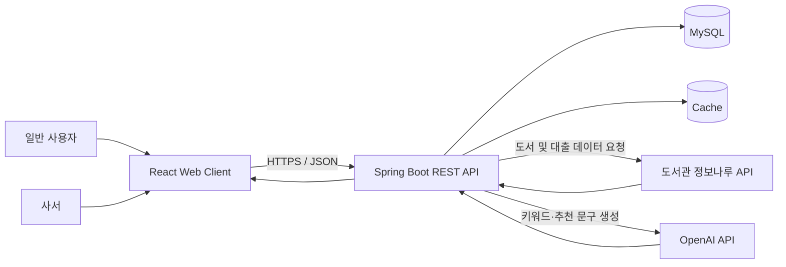
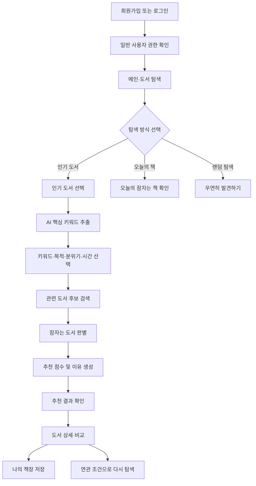
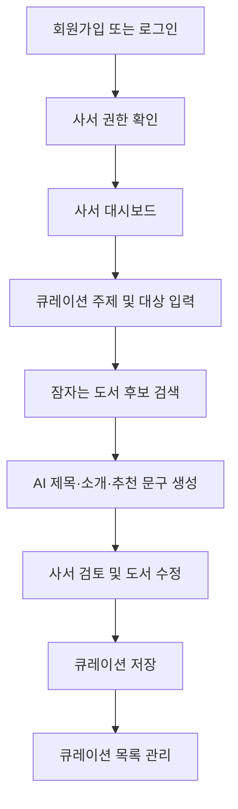

# 📚 WakeBook

> **인기 책에서 시작해, 잠자는 책을 깨우다.**

WakeBook은 인기 도서의 핵심 키워드와 사용자의 독서 목적을 바탕으로, 아직 충분히 주목받지 못한 도서를 발견하도록 돕는 **AI 기반 도서 탐색 및 큐레이션 서비스**입니다.

일반 사용자는 인기 도서에서 출발해 원하는 분위기와 독서 목적에 맞는 잠자는 도서를 추천받고, 사서는 저이용 도서를 활용한 전시형 북큐레이션을 생성하고 관리할 수 있습니다.

---

## 1. 프로젝트 소개

### 1.1 개발 배경 및 필요성

공공도서관에는 다양한 분야의 우수한 도서가 소장되어 있지만, 실제 대출은 베스트셀러와 신간에 집중되는 경향이 있습니다. 이로 인해 내용과 가치가 충분함에도 이용률이 낮아 독자에게 발견되지 못하는 도서가 지속적으로 발생합니다.

기존 도서 추천 서비스는 구매 이력, 대출 이력, 평점과 같은 사용자 행동 데이터를 기반으로 유사한 도서를 반복 추천하는 경우가 많습니다. 이러한 방식은 개인화에는 효과적이지만, 사용자가 기존 관심사를 벗어나 새로운 책을 발견하도록 돕는 데 한계가 있습니다.

또한 사서는 특정 주제에 맞는 도서를 선정하고, 전시 제목과 소개 문구를 작성하기 위해 많은 시간과 노력을 사용합니다. 특히 저이용 도서를 발굴하고 실제 큐레이션으로 연결하는 과정은 반복적인 자료 조사와 문구 작성이 필요합니다.

WakeBook은 이러한 문제를 해결하기 위해 다음과 같은 방향을 제시합니다.

- 인기 도서를 새로운 탐색의 출발점으로 활용
- AI를 이용해 도서의 핵심 키워드와 추천 이유 생성
- 키워드 관련성은 높지만 이용률은 낮은 잠자는 도서 발굴
- 인기 도서와 잠자는 도서를 비교하여 추천 근거 제공
- 사서의 북큐레이션 제작 및 관리 업무 지원

### 1.2 개발 목표 및 주요 내용

WakeBook의 핵심 목표는 단순히 인기 도서를 추천하는 것이 아니라, 사용자가 관심 있는 주제를 기반으로 새로운 도서를 발견하도록 돕는 것입니다.

#### 주요 목표

1. 인기 도서에서 핵심 주제를 추출하여 탐색의 진입 장벽을 낮춥니다.
2. 사용자의 독서 목적, 분위기, 예상 독서 시간을 추천 조건에 반영합니다.
3. 관련성은 높지만 이용률이 낮은 잠자는 도서를 발굴합니다.
4. 추천 점수와 AI 추천 이유를 통해 추천 결과의 신뢰도를 높입니다.
5. 일반 사용자와 사서에게 역할별 기능을 제공합니다.
6. 도서관 장서 활용률과 독서 다양성을 높입니다.

#### 주요 기능

- 일반 사용자와 사서 역할 기반 회원가입 및 로그인
- 인기 도서 및 분야별 도서 조회
- AI 핵심 키워드 추출
- 독서 목적·분위기·독서 시간 선택
- 잠자는 도서 추천 및 추천 적합도 제공
- 인기 도서와 잠자는 도서 비교
- 오늘의 잠자는 책 및 우연히 발견하기
- 나의 책장 및 사용자 컬렉션 관리
- 사서용 큐레이션 생성 및 관리
- AI 전시 제목, 소개 문구, 추천 문장 생성

### 1.3 서비스 세부 내용

#### 일반 사용자

일반 사용자는 메인 화면에서 인기 도서를 선택하거나 오늘의 잠자는 책을 확인할 수 있습니다. 인기 도서를 선택하면 AI가 도서의 핵심 키워드를 추출하고, 사용자는 원하는 독서 목적과 분위기, 독서 시간을 선택합니다.

시스템은 선택 조건을 바탕으로 관련 도서를 검색한 후, 이용률과 관련성, 정보 품질 등을 분석하여 잠자는 도서를 추천합니다.

추천 결과에는 도서 기본 정보, 추천 적합도, 키워드 관련성, 독서 목적 및 분위기 일치도, 발견 가치, AI 추천 이유, 기준 인기 도서와의 비교 정보가 포함됩니다.

마음에 드는 도서는 나의 책장에 저장하고 읽기 상태나 사용자 컬렉션으로 관리할 수 있습니다.

#### 사서

사서는 회원가입 시 역할을 `사서`로 선택하고 소속 도서관 및 기관 정보를 입력합니다.

사서 페이지에서는 다음 기능을 사용할 수 있습니다.

- 분야별 잠자는 도서 현황 확인
- 큐레이션 주제와 대상 입력
- 저이용 도서 후보 자동 추천
- AI 전시 제목 및 소개 문구 생성
- 도서별 추천 문장 및 해시태그 생성
- 추천 도서 추가·삭제 및 순서 변경
- 큐레이션 저장·수정·삭제
- 큐레이션 공개 여부 관리

### 1.4 기존 서비스 대비 차별성

| 구분 | 기존 도서 추천 서비스 | WakeBook |
|---|---|---|
| 탐색 방식 | 개인 이력 기반 추천 | 인기 도서의 키워드에서 탐색 시작 |
| 추천 대상 | 인기 도서 및 유사 도서 중심 | 관련성 높은 잠자는 도서 중심 |
| 사용자 입력 | 선호 분야 또는 평점 | 키워드, 독서 목적, 분위기, 독서 시간 |
| 추천 설명 | 간단한 유사 도서 안내 | 추천 점수, AI 추천 이유, 비교 정보 |
| 탐색 흐름 | 추천 목록 확인 후 종료 | 추천, 비교, 저장, 연관 탐색으로 확장 |
| 사서 지원 | 제한적 | 전시형 북큐레이션 생성 및 관리 |
| 사회적 목적 | 개인 만족도 중심 | 장서 활용률과 독서 다양성 향상 |

### 1.5 사회적 가치 도입 계획

- **장서 활용 가치 향상:** 이용률은 낮지만 주제 관련성과 정보 품질이 높은 도서를 발굴합니다.
- **독서 다양성 확대:** 베스트셀러와 신간 중심의 독서 편중을 줄입니다.
- **사서 업무 효율화:** 큐레이션 초안과 전시 문구 생성을 지원합니다.
- **공공 정보 활용:** 도서관 정보나루와 공공도서 데이터를 활용합니다.
- **디지털 접근성 강화:** 버튼과 태그 중심의 간단한 탐색 방식을 제공합니다.

---

## 2. 상세 설계

### 2.1 시스템 구성도



### 2.2 사용 기술

> 실제 제출 전 프로젝트의 `package.json`, `build.gradle`, 로컬 실행 환경과 일치하도록 버전을 수정합니다.

| 구분 | 기술 | 권장 버전 | 사용 목적 |
|---|---|---:|---|
| Frontend | React | 19.x | 사용자 인터페이스 개발 |
| Frontend | Vite | 7.x | 개발 서버 및 빌드 |
| Frontend | React Router | 7.x | 페이지 및 권한별 라우팅 |
| Frontend | Axios | 1.x | REST API 통신 |
| Frontend | Tailwind CSS | 4.x | UI 스타일링 |
| Backend | Java | 21 | 백엔드 애플리케이션 |
| Backend | Spring Boot | 3.5.x | REST API 및 비즈니스 로직 |
| Backend | Spring Security | 6.x | 인증 및 역할 기반 접근 제어 |
| Backend | Spring Data JPA | 3.x | 데이터베이스 접근 |
| Database | MySQL | 8.4 | 서비스 데이터 저장 |
| Authentication | JWT | - | 로그인 상태 및 권한 관리 |
| AI | OpenAI API | API 기반 | 키워드 및 추천 문구 생성 |
| Public API | 도서관 정보나루 API | Open API | 인기 도서 및 도서 정보 조회 |
| Documentation | Swagger / OpenAPI | 3.x | REST API 문서화 |
| Test | JUnit 5 | 5.x | 백엔드 단위 테스트 |
| Version Control | Git / GitHub | - | 버전 및 협업 관리 |
| Design | Figma | - | 화면 설계 및 프로토타입 |

---

## 3. 개발 결과

> 개발 진행 상황에 맞춰 스크린샷, GIF, 영상, 실제 URL을 추가합니다.

### 3.1 전체 시스템 흐름도

#### 일반 사용자 흐름



#### 사서 흐름



### 3.2 기능 설명

#### 로그인 페이지

- 이메일과 비밀번호의 필수 입력 여부 및 형식을 검사합니다.
- 유효성 검사를 통과하면 로그인 버튼을 활성화합니다.
- 인증 성공 후 역할이 `USER`이면 사용자 메인으로, `LIBRARIAN`이면 사서 대시보드로 이동합니다.
- 인증 실패 시 계정 정보 오류 문구를 표시합니다.

> 시연 자료: TODO

#### 회원가입 페이지

- 첫 단계에서 일반 사용자 또는 사서 역할을 선택합니다.
- 이메일 중복, 비밀번호 규칙, 비밀번호 확인 값을 검사합니다.
- 사서 선택 시 소속 도서관, 담당 부서, 기관 이메일, 인증 정보를 추가로 입력합니다.
- 일반 사용자는 즉시 가입되며, 사서는 승인 정책에 따라 승인 대기 상태로 생성할 수 있습니다.

> 시연 자료: TODO

#### 메인·도서 탐색 페이지

- 인기 도서, 분야별 도서, 오늘의 잠자는 책을 제공합니다.
- 검색어와 분야 필터를 통해 도서를 탐색합니다.
- `우연히 발견하기`를 누르면 품질 기준을 통과한 잠자는 도서 한 권을 보여줍니다.
- 인기 도서를 선택하면 통합 추천 페이지로 이동합니다.

> 시연 자료: TODO

#### 통합 추천 페이지

- AI가 선택한 인기 도서의 핵심 키워드를 추출합니다.
- 사용자는 키워드, 독서 목적, 분위기, 예상 독서 시간을 선택합니다.
- 추천 요청 시 관련 도서를 검색하고 잠자는 도서 기준을 적용합니다.
- 추천 결과는 같은 페이지 하단에 출력하여 이동을 최소화합니다.
- 추천 카드에서 상세 보기, 비교, 책장 저장, 연관 탐색을 실행합니다.

> 시연 자료: TODO

#### 추천 결과 카드

각 카드에는 다음 항목을 표시합니다.

- 표지, 제목, 저자
- 핵심 키워드
- 추천 적합도
- 키워드 관련성
- 독서 목적·분위기·시간 일치도
- 발견 가치
- AI 추천 이유

```text
최종 추천 점수 =
키워드 관련성 × 0.35
+ 독서 목적 일치도 × 0.20
+ 분위기 일치도 × 0.15
+ 독서 시간 일치도 × 0.10
+ 도서 정보 품질 × 0.10
+ 잠자는 도서 발견 가치 × 0.10
```

#### 도서 상세·비교 페이지

- 추천 도서의 상세 정보와 AI 추천 이유를 표시합니다.
- 기준 인기 도서와 잠자는 도서의 주제, 분위기, 난이도, 특징을 비교합니다.
- AI가 공통점과 차이점을 자연어로 설명합니다.
- 비슷한 주제, 같은 분위기, 더 쉬운 책, 더 깊이 있는 책, 반대 관점의 책으로 탐색을 이어갑니다.

> 시연 자료: TODO

#### 나의 책장 페이지

- 저장한 도서를 `읽고 싶은 책`, `읽는 중`, `다 읽은 책`, `나중에 다시 볼 책`으로 관리합니다.
- 사용자 지정 컬렉션을 생성할 수 있습니다.
- 저장한 도서의 상태 변경, 컬렉션 이동, 삭제를 지원합니다.
- 여러 권을 선택한 간단한 AI 묶음 결과는 별도 페이지가 아닌 모달 또는 인라인 카드로 제공합니다.

> 시연 자료: TODO

#### 사서 대시보드

- 잠자는 도서 후보 수, 최근 큐레이션, 분야별 저이용 도서, 추천 키워드를 표시합니다.
- `LIBRARIAN` 권한이 있는 사용자만 접근할 수 있습니다.
- 큐레이션 제작 및 관리 페이지로 이동합니다.

> 시연 자료: TODO

#### 사서 큐레이션 제작 페이지

- 주제, 대상 연령, 분위기, 분야, 도서 수, 제외 키워드, 목적을 입력합니다.
- 시스템은 잠자는 도서 후보와 AI 큐레이션 제목, 소개 문구, 도서별 설명, 해시태그를 생성합니다.
- 사서는 후보 도서를 교체하고 순서를 수정한 뒤 저장합니다.

> 시연 자료: TODO

#### 큐레이션 관리 페이지

- 저장한 큐레이션을 조회, 수정, 복제, 삭제합니다.
- 제목, 설명, 도서 목록, 순서, 공개 여부를 관리합니다.
- 이미지 또는 PDF 출력은 향후 확장 기능으로 둡니다.

> 시연 자료: TODO

### 3.3 기능 명세서

> TODO: Notion, Google Spreadsheet, PDF 또는 `docs/05_API_Specification.md` 링크 추가

### 3.4 디렉토리 구조

```text
WakeBook/
├── frontend/
│   ├── public/
│   ├── src/
│   │   ├── api/
│   │   ├── assets/
│   │   ├── components/
│   │   ├── features/
│   │   │   ├── auth/
│   │   │   ├── books/
│   │   │   ├── recommendations/
│   │   │   ├── bookshelf/
│   │   │   └── librarian/
│   │   ├── hooks/
│   │   ├── layouts/
│   │   ├── pages/
│   │   ├── routes/
│   │   ├── store/
│   │   ├── styles/
│   │   ├── utils/
│   │   ├── App.jsx
│   │   └── main.jsx
│   ├── .env.example
│   ├── package.json
│   └── vite.config.js
├── backend/
│   ├── src/
│   │   ├── main/
│   │   │   ├── java/com/wakebook/
│   │   │   │   ├── auth/
│   │   │   │   ├── book/
│   │   │   │   ├── recommendation/
│   │   │   │   ├── bookshelf/
│   │   │   │   ├── curation/
│   │   │   │   ├── librarian/
│   │   │   │   ├── external/
│   │   │   │   ├── global/
│   │   │   │   └── WakeBookApplication.java
│   │   │   └── resources/
│   │   └── test/
│   ├── .env.example
│   ├── build.gradle
│   └── settings.gradle
├── docs/
│   ├── 01_Service_Plan.md
│   ├── 02_Development_Plan.md
│   ├── 03_ERD.md
│   ├── 04_System_Architecture.md
│   ├── 05_API_Specification.md
│   ├── 06_DB_Design.md
│   ├── 07_User_Flow.md
│   └── images/
├── .gitignore
├── README.md
└── LICENSE
```

---

## 4. 설치 및 사용 방법

### 4.1 사전 설치 소프트웨어

- Git
- Node.js 20 이상
- npm 10 이상
- Java 21
- MySQL 8 이상

### 4.2 저장소 복제

```bash
git clone https://github.com/USERNAME/WakeBook.git
cd WakeBook
```

### 4.3 프론트엔드 설치 및 실행

```bash
cd frontend
npm install
cp .env.example .env
npm run dev
```

```env
VITE_API_BASE_URL=http://localhost:8080/api
```

기본 접속 주소는 `http://localhost:5173`입니다.

#### `vite: command not found` 오류

```bash
npm install
npm run dev
```

문제가 계속되면 다음과 같이 다시 설치합니다.

```bash
rm -rf node_modules package-lock.json
npm install
npm run dev
```

### 4.4 데이터베이스 설정

```sql
CREATE DATABASE wakebook
CHARACTER SET utf8mb4
COLLATE utf8mb4_unicode_ci;
```

```env
DB_URL=jdbc:mysql://localhost:3306/wakebook
DB_USERNAME=root
DB_PASSWORD=your_password
JWT_SECRET=your_jwt_secret
LIBRARY_DATA_API_KEY=your_library_api_key
OPENAI_API_KEY=your_openai_api_key
```

### 4.5 백엔드 실행

```bash
cd backend
./gradlew bootRun
```

Windows:

```bash
gradlew.bat bootRun
```

기본 주소는 `http://localhost:8080`입니다.

Swagger 적용 시:

```text
http://localhost:8080/swagger-ui/index.html
```

### 4.6 전체 실행 순서

1. MySQL 서버 실행
2. `wakebook` 데이터베이스 생성
3. 백엔드 환경 변수 설정
4. Spring Boot 서버 실행
5. 프론트엔드 환경 변수 설정
6. React 개발 서버 실행
7. `http://localhost:5173` 접속

---

## 5. 소개 및 시연 영상

- **소개 영상:** TODO
- **시연 영상:** TODO
- **배포 URL:** TODO
- **API 문서:** TODO

---

## 6. 팀 소개

| 이름 | 역할 | 담당 업무 | 연락처 |
|---|---|---|---|
| TODO | Frontend | UI/UX, React 페이지, API 연동 | TODO |
| TODO | Backend | Spring Boot, 인증, DB, 외부 API 연동 | TODO |
| TODO | AI / Data | 키워드 분석, 추천 로직, 큐레이션 프롬프트 | TODO |

---

## 7. 해커톤 참여 후기

### 팀원 1

> TODO: 맡은 역할, 해결한 문제, 배운 점을 작성합니다.

### 팀원 2

> TODO: 협업 과정, 기술적 도전, 참여 소감을 작성합니다.

### 팀원 3

> TODO: 사용자 가치, 향후 개선점, 성장한 부분을 작성합니다.

---

## 8. 핵심 추천 기준

WakeBook은 대출량이 낮다는 이유만으로 도서를 추천하지 않습니다.

1. 선택 키워드와의 관련성
2. 독서 목적과의 일치도
3. 원하는 분위기와의 일치도
4. 예상 독서 시간과의 적합성
5. 도서 설명 및 메타데이터 품질
6. 동종 분야 대비 낮은 이용률
7. 최근 반복 노출 여부

```text
잠자는 도서 후보 =
관련성 기준 통과
AND 도서 정보 품질 기준 통과
AND 동종 분야 평균보다 낮은 대출량
AND 최근 인기 도서 목록에 포함되지 않음
```

---

## 9. 권한별 기능

| 기능 | 일반 사용자 | 사서 |
|---|:---:|:---:|
| 인기 도서 조회 | O | O |
| 잠자는 도서 추천 | O | O |
| 도서 상세 및 비교 | O | O |
| 나의 책장 | O | O |
| 사용자 컬렉션 생성 | O | O |
| 사서 대시보드 | X | O |
| 전시 큐레이션 생성 | X | O |
| 큐레이션 관리 | X | O |
| 전시 문구 생성 | X | O |

---

## 10. API 요약

### 인증

| Method | Endpoint | 설명 |
|---|---|---|
| POST | `/api/auth/signup` | 회원가입 |
| POST | `/api/auth/login` | 로그인 |
| GET | `/api/auth/me` | 로그인 사용자 조회 |

### 도서

| Method | Endpoint | 설명 |
|---|---|---|
| GET | `/api/books/popular` | 인기 도서 조회 |
| GET | `/api/books/search` | 도서 검색 |
| GET | `/api/books/{isbn}` | 도서 상세 조회 |
| GET | `/api/books/today` | 오늘의 잠자는 책 |
| GET | `/api/books/random` | 우연히 발견하기 |

### 추천 및 AI

| Method | Endpoint | 설명 |
|---|---|---|
| POST | `/api/ai/keywords` | 핵심 키워드 추출 |
| POST | `/api/recommendations` | 잠자는 도서 추천 |
| POST | `/api/comparisons` | 인기·잠자는 도서 비교 |
| POST | `/api/recommendations/explore` | 연관 조건 재탐색 |

### 책장

| Method | Endpoint | 설명 |
|---|---|---|
| GET | `/api/bookshelves` | 내 책장 목록 |
| POST | `/api/bookshelves` | 사용자 책장 생성 |
| PATCH | `/api/bookshelves/{shelfId}` | 책장 수정 |
| DELETE | `/api/bookshelves/{shelfId}` | 책장 삭제 |
| POST | `/api/bookshelves/{shelfId}/books` | 책장에 도서 추가 |
| PATCH | `/api/bookshelves/{shelfId}/books/{bookId}` | 도서 상태 변경 |
| DELETE | `/api/bookshelves/{shelfId}/books/{bookId}` | 책장에서 도서 삭제 |

### 사서

| Method | Endpoint | 설명 |
|---|---|---|
| GET | `/api/librarian/dashboard` | 사서 대시보드 조회 |
| POST | `/api/librarian/curations/generate` | AI 큐레이션 초안 생성 |
| POST | `/api/librarian/curations` | 큐레이션 저장 |
| GET | `/api/librarian/curations` | 큐레이션 목록 |
| GET | `/api/librarian/curations/{id}` | 큐레이션 상세 |
| PATCH | `/api/librarian/curations/{id}` | 큐레이션 수정 |
| DELETE | `/api/librarian/curations/{id}` | 큐레이션 삭제 |

---

## 11. 개발 일정

| 주차 | 목표 | 주요 작업 |
|---|---|---|
| 1주차 | 기반 구축 | 요구사항 확정, Figma, React·Spring Boot 생성, DB 설계, 외부 API 연동 테스트 |
| 2주차 | 핵심 탐색 구현 | 회원가입·로그인, 역할 구분, 인기 도서 조회, AI 키워드, 통합 추천 UI |
| 3주차 | 추천 및 역할별 기능 | 잠자는 도서 판별, 추천 점수·이유, 상세·비교, 책장, 사서 큐레이션 |
| 4주차 | 통합 및 제출 | 큐레이션 관리, UI 개선, 예외 처리, 테스트, 문서화, 시연 영상 |

---

## 12. 개발 우선순위

### 반드시 구현

- 역할 기반 회원가입 및 로그인
- 인기 도서 조회
- 핵심 키워드 추출
- 독서 조건 선택
- 잠자는 도서 추천
- 추천 적합도 및 추천 이유
- 도서 상세 및 비교
- 나의 책장
- 사서 큐레이션 생성 및 저장

### 단순화 가능

- 추천 점수는 규칙 기반 가중치 방식 사용
- 오늘의 잠자는 책은 조건 통과 후보 중 일 단위 랜덤 선택
- 사서 인증은 테스트 계정 또는 승인 상태 고정
- 이미지·PDF 출력은 후순위 기능으로 분리

---

## 13. 테스트 계획

- 회원가입 역할별 입력 검증
- 일반 사용자와 사서 권한 분리
- 인기 도서 및 상세 조회
- 추천 조건별 결과 변화
- 책장 저장·수정·삭제
- 큐레이션 생성·수정·삭제
- 외부 API 지연 및 실패 처리
- AI 응답 형식 오류 처리
- 모바일 화면 사용성 점검

---

## 14. 위험 요소 및 대응 방안

| 위험 요소 | 영향 | 대응 방안 |
|---|---|---|
| 정보나루 API 응답 지연 | 도서 목록 로딩 지연 | 캐시, 로딩 UI, 재시도 |
| API 호출 제한 | 서비스 기능 제한 | 결과 캐싱, 중복 호출 방지 |
| AI 응답 형식 불일치 | 화면 렌더링 오류 | JSON 응답 강제, 서버 검증 |
| 도서 소개 데이터 부족 | 키워드 품질 저하 | 제목·분류·저자 등 보조 데이터 활용 |
| 낮은 대출량의 의미 불명확 | 품질 낮은 책 추천 가능 | 관련성·정보 품질 기준과 함께 평가 |
| 한 달 개발 일정 | 기능 미완성 가능 | 핵심 기능 우선, 출력 기능 후순위 |
| 사서 자격 검증 어려움 | 권한 오용 가능 | 테스트 계정 또는 관리자 승인 구조 |

---

## 15. 향후 발전 방향

- 실제 도서관 소장 및 대출 가능 여부 연동
- 사용자 독서 이력 기반 개인화
- 사서 계정 관리자 승인
- 큐레이션 이미지 및 PDF 출력
- 사용자 간 책장·큐레이션 공유
- 임베딩 기반 의미 검색
- 전국 도서관 장서 데이터 연계
- 모바일 애플리케이션 제공
- 접근성 표준 및 다국어 지원

---

## 16. 프로젝트 문서

| 문서 | 설명 |
|---|---|
| `docs/01_Service_Plan.md` | 서비스 기획서 |
| `docs/02_Development_Plan.md` | 개발 계획서 |
| `docs/03_ERD.md` | ERD 및 엔터티 관계 |
| `docs/04_System_Architecture.md` | 시스템 구성 및 인프라 |
| `docs/05_API_Specification.md` | REST API 상세 명세 |
| `docs/06_DB_Design.md` | 데이터베이스 테이블 명세 |
| `docs/07_User_Flow.md` | 일반 사용자 및 사서 플로우 |

---

## 17. 라이선스

> TODO: 프로젝트 정책에 맞는 라이선스를 선택합니다.

<p align="center">
  <strong>WakeBook</strong><br />
  인기 책에서 시작해, 잠자는 책을 깨우다.
</p>
