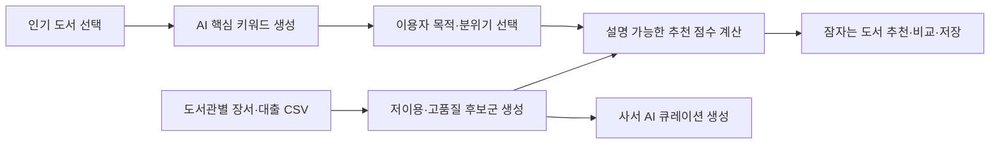
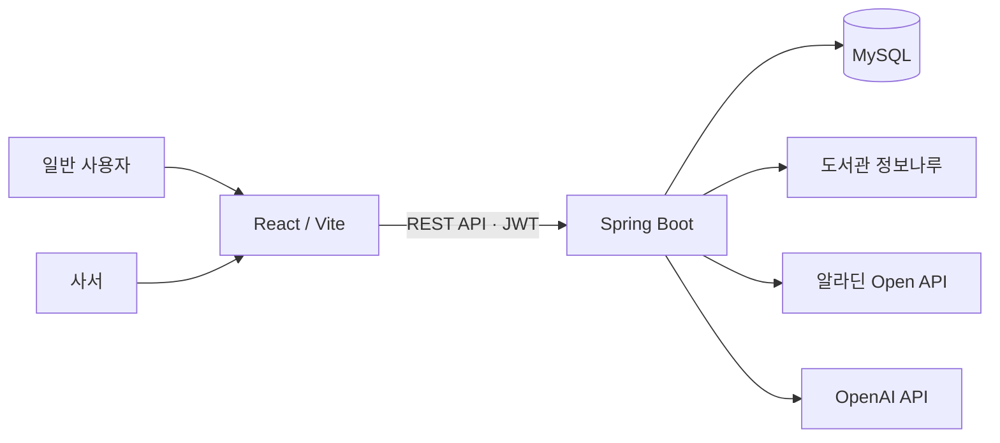

# [서비스 아이디어 제안] WakeBook

> **인기 책에서 시작해, 잠자는 책을 깨우다**  
> 본 원고는 공모전 제출용 익명 초안입니다. 제출본에는 팀명·참가자명·소속·저장소 주소 등 개인정보를 기재하지 않습니다.

---

## 요약문

| 구분 | 내용 |
|---|---|
| **기획의도 및<br>내용 요약 설명** | **WakeBook**은 인기 도서에 집중되는 도서관 이용 행태 속에서, 이용률이 낮아 충분히 발견되지 못한 장서를 다시 독자에게 연결하는 AI 기반 도서 탐색·큐레이션 서비스이다.<br><br>이용자는 인기 도서를 출발점으로 삼아 AI 핵심 키워드, 독서 목적, 분위기를 선택한다. 서비스는 해당 도서관의 장서·대출목록에서 선별한 저이용·고품질 도서 후보군을 대상으로 관련 도서를 추천하고, 추천 이유와 인기 도서와의 공통점·차이점을 제공한다.<br><br>사서는 자기 도서관의 장서·대출목록 CSV를 업로드하여 잠자는 도서 후보군을 갱신하고, 전시 주제를 입력해 AI 큐레이션 초안을 생성·저장할 수 있다. WakeBook은 이용자에게는 새로운 독서 경험을, 도서관에는 저이용 장서 발굴과 북큐레이션 업무 지원을 제공한다. |
| **활용 도서관<br>데이터** | **필수 활용 데이터 — 도서관 정보나루**<br>1. 인기 도서 및 대출 정보: 인기 도서를 탐색의 출발점으로 제공하고, ISBN·제목·저자·순위·대출 수를 기준 도서 정보로 활용한다.<br>2. 도서 검색·상세·소장 정보: 제목·저자·출판사·도서관 소장 여부를 확인한다.<br>3. 도서관별 장서·대출목록 CSV: 사서가 도서관 정보나루 오픈데이터에서 내려받아 업로드하며, 도서관 코드별 저이용 도서 후보군을 생성하는 핵심 데이터로 활용한다.<br><br>**보조 데이터**<br>알라딘 Open API의 도서 소개·목차·표지 정보를 품질 검증 및 AI 입력 보조 정보로 활용한다.<br><br>**향후 확장 데이터**<br>국립중앙도서관 국가서지·Open API 또는 국가서지 LOD의 KDC 분류·주제명·표준 서지정보를 활용하여 ISBN 정규화, 분야 다양성 분석, 주제 기반 추천 근거 보강을 추진한다. |
| **활용기술** | **데이터 처리**: CSV 파싱, ISBN 기준 정규화, 도서관 코드별 데이터 분리, 대출 수 오름차순 정렬, 누락·오류 데이터 제외<br><br>**후보 선정 모델**: 최근 12개월 장서·대출목록에서 대출 수가 2회 이하인 도서를 우선 선별하고, 제목·저자·출판사·도서 소개 등 필수 정보가 확인되는 도서를 품질 검증한다.<br><br>**추천 모델**: 키워드 관련성(45%), 독서 목적 적합도(20%), 분위기 적합도(15%), 발견 가치(20%)를 결합한 설명 가능한 점수 모델을 적용한다.<br><br>**AI 기술**: OpenAI API 기반 LLM을 활용해 핵심 키워드, 동의어 통합 키워드, 추천 이유, 큐레이션 제목·소개·해시태그를 생성한다. 도서 기본정보·소장·대출 수는 AI가 생성하지 않고 도서관 데이터와 외부 서지정보를 기준으로 한다.<br><br>**구현 기술**: React/Vite, Spring Boot, Spring Security/JWT, MySQL, Flyway, REST API |
| **추진과정** | 1. 정보나루 인기 도서·도서 상세 API와 장서·대출목록 CSV의 데이터 구조를 분석한다.<br>2. 사서가 CSV를 업로드하면 도서관 코드별로 데이터를 분리하고, 대출 수·서지정보 기준으로 잠자는 도서 후보군을 생성한다.<br>3. 인기 도서의 소개·목차를 바탕으로 AI 키워드를 생성하고, 이용자가 고른 키워드·독서 목적·분위기를 추천 조건으로 구성한다.<br>4. 후보군에서 기준 인기 도서와의 관련성 및 발견 가치를 계산하여 잠자는 도서를 추천한다.<br>5. 추천 결과에는 점수, 키워드, 추천 이유, 인기 도서와의 비교 정보를 함께 제공한다.<br>6. 사서는 후보군을 바탕으로 전시 주제별 AI 큐레이션 초안을 생성·저장한다.<br>7. 사서 권한과 도서관 코드를 검증하여 다른 도서관의 후보군을 변경하지 못하도록 보완한다. |
| **결과물** | 1. React 기반 WakeBook 웹 화면: 홈, 인기 도서 탐색, AI 추천, 비교, 오늘의 책, 랜덤 탐색, 책장, 사서 큐레이션 화면<br>2. Spring Boot 기반 API: 인증, 도서 검색·상세, AI 키워드·추천·비교, 책장, 사서 대시보드·큐레이션, CSV 업로드 API<br>3. MySQL 데이터 모델: 사용자, 책장, 큐레이션, 도서관별 잠자는 도서 후보군<br>4. 데이터 처리 산출물: 도서관 코드별 후보군, 추천 점수·추천 이유, 큐레이션 초안<br>5. 최종 시연: 인기 도서 선택 → 키워드 선택 → 잠자는 도서 추천 → 비교·저장 또는 사서 큐레이션 생성 흐름 |
| **기대효과** | **이용자**: 인기 도서에 머물지 않고 관심 주제와 연결된 새로운 도서를 발견하며, 추천 이유를 통해 선택 근거를 확인할 수 있다.<br><br>**도서관·사서**: 저이용 장서를 도서관별로 분석해 전시·추천 후보를 찾는 시간을 줄이고, AI 큐레이션 초안으로 반복적인 소개문 작성 업무를 지원한다.<br><br>**사회적 효과**: 도서관 장서 활용도를 높이고, 다양한 분야의 독서 경험과 지역 도서관 이용 활성화에 기여한다.<br><br>**측정 지표**: 후보 도서 수, 추천 생성 수, 상세 조회 수, 책장 저장 수, 큐레이션 생성 수, 추천·전시 전후 대출 변화, 사서 큐레이션 제작 시간 절감 |

---

## 목차

Ⅰ. 제안 배경 및 문제 정의  
Ⅱ. 활용 데이터 및 분석 설계  
Ⅲ. WakeBook 서비스 및 추천 모델  
Ⅳ. 추진 과정 및 구현 결과  
Ⅴ. 기대효과 및 확산 방안  
참고문헌  
부록  

---

# Ⅰ. 제안 배경 및 문제 정의

## 1. 인기 도서 중심 이용과 저이용 장서 문제

공공도서관에는 다양한 주제와 수준의 장서가 축적되어 있으나, 실제 대출은 베스트셀러와 신간에 집중되는 경향이 있다. 이 과정에서 주제 관련성과 내용의 품질이 충분함에도 낮은 이용률로 인해 독자에게 발견되지 못하는 도서가 생긴다. WakeBook은 이러한 도서를 단순히 미대출 도서로 전시하는 데서 나아가, 이용자가 이미 관심을 보인 인기 도서와 연결하여 발견하도록 설계한다.

## 2. 기존 방식의 한계

기존 미대출 도서 전시는 정해진 기간과 장소에서 도서를 노출하는 방식이 많아, 이용자의 현재 관심사와 개별 도서를 연결하기 어렵다. 일반적인 도서 추천 서비스는 구매·대출 이력을 활용하지만, 익숙한 분야를 반복적으로 제안할 가능성이 있다. 또한 사서는 장서·대출 데이터를 검토해 전시 후보를 선정하고 소개 문구를 작성해야 하므로 반복 업무 부담이 존재한다.

## 3. 제안의 차별성

WakeBook은 다음의 흐름을 하나의 서비스로 연결한다.



첫째, 추천 대상이 온라인 서점의 전체 도서가 아니라 **해당 도서관에 실제 소장된 저이용 장서**이다. 둘째, 인기 도서의 키워드를 출발점으로 사용하므로 이용자는 낯선 장서에도 쉽게 진입할 수 있다. 셋째, 이용자 추천과 사서 큐레이션이 동일한 도서관별 후보군을 공유하므로 서비스와 장서 운영이 연결된다.

---

# Ⅱ. 활용 데이터 및 분석 설계

## 1. 데이터 구성

<표 1> WakeBook 활용 데이터

| 구분 | 데이터 | 주요 항목 | 활용 목적 |
|---|---|---|---|
| 필수 도서관 데이터 | 도서관 정보나루 인기 도서·대출 정보 | ISBN, 제목, 저자, 순위, 대출 수 | 인기 도서 탐색 및 기준 도서 선정 |
| 필수 도서관 데이터 | 도서관 정보나루 장서·대출목록 CSV | ISBN, 도서명, 대출 수, 도서관 코드 | 도서관별 저이용 후보군 생성 |
| 필수 도서관 데이터 | 도서관 정보나루 도서 검색·상세·소장 정보 | 서지정보, 소장 도서관, 대출 가능 여부 | 도서 상세 제공 및 추천 후 확인 |
| 보조 서지 데이터 | 알라딘 Open API | 소개, 목차, 표지 | 품질 검증과 AI 분석 입력 보강 |
| 향후 확장 | 국립중앙도서관 국가서지·Open API·LOD | KDC, 주제명, 표준 서지정보 | 분야 다양성 분석, 주제명 기반 추천, 서지 정규화 |

## 2. 잠자는 도서 후보군 정의

WakeBook에서 잠자는 도서는 단순히 “대출 수가 적은 책”이 아니다. 도서관별 장서·대출목록에서 저이용 도서를 우선 선별한 뒤, 추천 가능한 최소 정보와 품질 조건을 충족한 도서를 후보군으로 구성한다.

<표 2> 잠자는 도서 후보 선정 기준

| 단계 | 기준 | 처리 내용 |
|---|---|---|
| 1 | 도서관 분리 | CSV의 도서관 코드 기준으로 후보군을 분리 저장 |
| 2 | 저이용 필터 | 최근 12개월 대출 수 2회 이하 도서를 우선 선별 |
| 3 | 서지 정규화 | ISBN 기준 중복을 제거하고 제목·저자·출판사 정보를 확인 |
| 4 | 품질 검증 | 도서 소개 길이, 저자·출판사·표지·발행연도 정보 존재 여부를 확인 |
| 5 | 후보 저장 | 조건을 통과한 도서를 `hidden_books` 후보군으로 저장 |

## 3. 데이터 윤리 및 운영 원칙

- 이용자 개인의 대출 이력이나 개인 식별 정보는 수집·분석하지 않는다.
- 도서관별 CSV는 사서 권한으로만 업로드하며, 로그인 사서의 도서관 코드와 업로드 요청의 도서관 코드를 검증한다.
- 추천의 근거가 되는 대출 수·소장 정보·서지정보는 공공 데이터와 제공 API를 기준으로 한다.
- AI는 추천 이유와 키워드 생성에 활용하며, 사실 정보나 대출 가능 여부를 임의로 생성하지 않는다.

---

# Ⅲ. WakeBook 서비스 및 추천 모델

## 1. 사용자 서비스

1. 인기 도서 또는 도서 검색 결과에서 관심 도서를 선택한다.
2. AI가 도서 소개와 목차를 분석하여 핵심 키워드를 제안한다.
3. 이용자는 키워드, 독서 목적, 원하는 분위기, 도서관 코드를 입력한다.
4. 서비스는 해당 도서관의 잠자는 도서 후보군에서 관련 도서를 추천한다.
5. 이용자는 추천 이유, 추천 적합도, 키워드 관련성, 발견 가치를 확인하고 인기 도서와 비교한다.

## 2. 사서 서비스

1. 사서 계정은 소속 도서관명, 도서관 코드, 담당 부서와 함께 가입한다.
2. 사서는 도서관 정보나루 장서·대출목록 CSV를 업로드해 후보군을 갱신한다.
3. 사서는 후보 도서 수와 주요 키워드를 확인한다.
4. 전시 주제·대상·분위기를 입력해 AI 큐레이션 초안을 생성한다.
5. 초안의 제목, 소개문, 추천 도서와 추천 이유를 검토한 뒤 저장한다.

## 3. 추천 점수 모델

WakeBook은 결과의 설명 가능성을 위해 다음과 같이 추천 점수를 구성한다.

```text
최종 추천 점수 =
키워드 관련성(45%)
+ 독서 목적 적합도(20%)
+ 분위기 적합도(15%)
+ 발견 가치(20%)
```

<표 3> 추천 점수 구성

| 요소 | 비중 | 설명 |
|---|---:|---|
| 키워드 관련성 | 45% | 기준 인기 도서와 후보 도서의 핵심 키워드·주제 관련성 |
| 독서 목적 적합도 | 20% | 마음의 위로, 새로운 관점, 실용적 해결책, 깊이 있는 사유와의 적합성 |
| 분위기 적합도 | 15% | 따뜻한, 담백한, 유쾌한, 사색적인 분위기와의 적합성 |
| 발견 가치 | 20% | 낮은 이용률, 품질 검증 통과, 인기 도서와 다른 관점 제공 여부 |

## 4. AI 활용 범위

<표 4> AI 활용 방식

| 구분 | 입력 | 출력 | 검증 원칙 |
|---|---|---|---|
| 핵심 키워드 생성 | 제목, 소개, 목차 | 3~5개 핵심 키워드 | 불필요어 제거·동의어 통합 |
| 추천 이유 생성 | 기준 도서, 후보 도서, 선택 조건 | 독자 친화적 추천 이유 | 후보 도서의 실제 서지정보만 사용 |
| 큐레이션 생성 | 전시 주제, 대상, 분위기, 후보군 | 제목, 소개, 해시태그, 추천 목록 | 사서가 저장 전 검토 |

---

# Ⅳ. 추진 과정 및 구현 결과

## 1. 시스템 구성



## 2. 현재 구현 결과

<표 5> 구현 현황

| 영역 | 구현 내용 | 상태 |
|---|---|:---:|
| 인증 | 사용자·사서 역할 기반 회원가입, 로그인, JWT 인증 | 구현 완료 |
| 도서 탐색 | 인기 도서, 검색, 상세 정보, 소장·대출 상태 조회 | 구현 완료 |
| AI 추천 | 키워드 생성, 잠자는 도서 추천, 인기 도서 비교 | 구현 완료 |
| 책장 | 목록 조회, 읽기 상태 변경, 도서 삭제 API | 구현 완료 |
| 사서 기능 | 대시보드, 큐레이션 초안 생성·저장 API | 구현 완료 |
| CSV 후보군 | 장서·대출 CSV 업로드와 후보군 생성 API | 구현 완료 |
| CSV 업로드 화면 | 사서 웹 화면 | 구현 예정 |
| 큐레이션 목록·수정·삭제 화면 | 사서 웹 화면 | 구현 예정 |
| 실제 통합 검증 | Java 21·MySQL·외부 API 키 환경에서의 전체 시연 | 진행 예정 |

## 3. 최종 결과물 시연 계획

1. 사서 계정으로 특정 도서관의 장서·대출목록 CSV를 업로드한다.
2. 대출 수와 품질 조건을 통과한 잠자는 도서 후보군을 확인한다.
3. 일반 사용자가 인기 도서를 선택하고 AI 키워드·독서 목적·분위기를 고른다.
4. 같은 도서관 코드의 후보군에서 추천된 잠자는 도서와 추천 이유를 확인한다.
5. 인기 도서와 추천 도서를 비교하고, 사서는 해당 후보군으로 전시 큐레이션 초안을 생성한다.

> 제출 전에는 실제 CSV 1건을 활용한 후보군 생성 결과, 추천 결과 화면, 사서 큐레이션 화면을 [그림 1]~[그림 3]으로 삽입한다.

---

# Ⅴ. 기대효과 및 확산 방안

## 1. 기대효과

<표 6> 기대효과 및 측정 지표

| 대상 | 기대효과 | 측정 지표 |
|---|---|---|
| 이용자 | 관심 주제에서 새로운 장서를 발견 | 추천 생성 수, 상세 조회 수, 책장 저장 수 |
| 도서관 | 저이용 장서의 노출과 활용 확대 | 후보 도서 수, 추천·전시 전후 대출 변화 |
| 사서 | 후보 선정·소개문 작성 업무 부담 경감 | 큐레이션 생성 수, 수작업 대비 제작 시간 |
| 지역사회 | 다양한 분야의 독서 경험과 도서관 이용 활성화 | 분야별 추천 분포, 이용자·사서 만족도 |

## 2. 활용성 및 지속가능성

WakeBook은 특정 도서관 한 곳에 고정된 시스템이 아니라, 사서가 자기 도서관의 장서·대출목록을 업로드하면 도서관 코드별 후보군을 구성하는 구조이다. 따라서 도서관별 장서 특성에 맞게 확장할 수 있다.

정기 업로드 또는 월별 갱신을 통해 후보군을 최신화할 수 있으며, 사서가 생성한 큐레이션은 오프라인 전시, 도서관 홈페이지, SNS 홍보 문구 등으로 활용할 수 있다.

## 3. 향후 발전 방향

- 국립중앙도서관 국가서지·KDC·주제명 데이터를 활용한 추천 근거 강화
- 연령·지역별 정보나루 대출 통계를 활용한 맞춤형 큐레이션
- 추천·전시 전후 대출 변화 분석을 통한 효과 검증
- 사서용 CSV 업로드 및 큐레이션 관리 화면 완성
- 책장 저장·독서 기록 기반의 분야 확장 독서 여정 시각화
- 지역 인구·문화 행사 등 공공데이터와 결합한 지역 맞춤형 전시 주제 추천

---

# 참고문헌

> 제출 전 실제 열람일과 정확한 자료 제목을 확인하여 APA 양식으로 보완한다.

- 국립중앙도서관. (2026). *2026 도서관 데이터 활용 공모전 안내문*.
- 도서관 정보나루. (2026). *도서관 정보나루 Open API 및 오픈데이터 안내*. https://www.data4library.kr
- 국립중앙도서관. (2026). *국가서지 및 Open API 안내*. https://www.nl.go.kr
- 알라딘. (2026). *알라딘 Open API 안내*. https://www.aladin.co.kr

# 부록. 제출 전 점검표

- [ ] 원고 본문에서 팀명·이름·소속·연락처·저장소 링크를 제거했는가?
- [ ] 요약문 1매에 기획의도, 도서관 데이터, 활용기술, 추진과정, 결과물, 기대효과를 모두 포함했는가?
- [ ] 모든 표와 그림에 번호 및 출처를 기재했는가?
- [ ] 정보나루 데이터의 실제 API명·CSV명·열람일을 확인했는가?
- [ ] AI 기술 종류, 입력, 산출물, 검증 방식을 명시했는가?
- [ ] 화면 시연 이미지와 실제 CSV 기반 후보군 생성 결과를 넣었는가?
- [ ] 참고문헌을 APA 양식으로 정리했는가?
