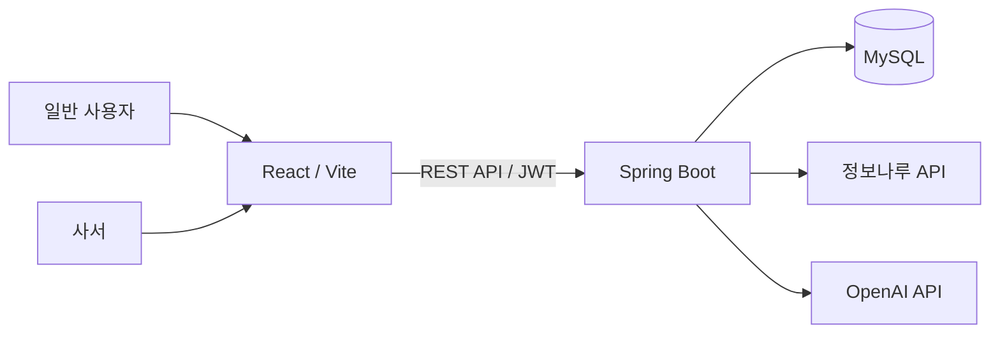

# WakeBook 중간보고서

> 작성일: YYYY.MM.DD  
> 팀명:  
> 작성자:  
> 프로젝트 저장소:  

## 1. 프로젝트 개요

### 1.1 프로젝트명

WakeBook — 인기 책에서 시작해, 잠자는 책을 깨우다

### 1.2 개발 배경 및 필요성

공공도서관에는 다양한 양질의 도서가 소장되어 있지만, 실제 대출은 베스트셀러와 신간에 집중되는 경향이 있습니다. WakeBook은 인기 도서의 핵심 키워드를 출발점으로 이용률은 낮지만 주제 관련성이 높은 도서를 발견하도록 돕는 AI 기반 도서 탐색·큐레이션 서비스입니다.

### 1.3 목표

- 인기 도서 기반의 자연스러운 탐색 흐름 제공
- AI 키워드·추천 이유를 활용한 잠자는 도서 발굴
- 일반 사용자와 사서의 역할별 기능 제공
- 도서관 장서 활용률 및 독서 다양성 향상

## 2. 개발 진행 현황

### 2.1 완료 기능

| 구분 | 기능 | 상태 | 비고 |
|---|---|:---:|---|
| 프론트엔드 | 역할별 회원가입·로그인 UI | 완료 | 사용자/사서 화면 분리 |
| 프론트엔드 | 인기 도서·추천·비교 화면 | 완료 | API 연동 진행 중 |
| 프론트엔드 | 나의 책장·사서 큐레이션 UI | 완료 | API 연동 진행 중 |
| 백엔드 | JWT 인증 및 회원 관리 | 완료 | USER / LIBRARIAN 권한 |
| 백엔드 | 도서 검색·인기 도서 조회 | 완료 | 정보나루 API 연동 |
| 백엔드 | AI 키워드·추천·비교 | 완료 | OpenAI 연동 구조 |
| 백엔드 | 책장·사서 큐레이션 API | 완료 | DB 마이그레이션 포함 |

### 2.2 현재 진행 중인 작업

- 프론트엔드와 Spring Boot API 실제 연동
- JWT 토큰 기반 인증 상태 처리
- 추천 결과·오늘의 책·책장 데이터 화면 반영
- API 오류 및 로딩 상태 UI 보완

## 3. 시스템 구성

## 4. 핵심 기능 및 화면

### 4.1 일반 사용자

1. 인기 도서를 선택합니다.
2. AI 키워드와 독서 목적·분위기·독서 시간을 고릅니다.
3. 조건에 맞는 잠자는 도서와 추천 이유를 확인합니다.
4. 인기 도서와 추천 도서를 비교하거나 나의 책장에 저장합니다.

### 4.2 사서

1. 사서 역할로 회원가입 또는 로그인합니다.
2. 사서 대시보드에서 잠자는 도서 현황을 확인합니다.
3. 전시 주제와 대상 조건을 입력합니다.
4. AI 큐레이션 초안을 검토하고 저장·관리합니다.

## 5. 기술 스택

| 영역 | 기술 |
|---|---|
| Frontend | React, Vite, React Router, Axios |
| Backend | Java 21, Spring Boot, Spring Security, JPA |
| Database | MySQL, Flyway |
| AI | OpenAI API |
| 외부 데이터 | 도서관 정보나루 API, 알라딘 API |

## 6. 향후 계획

- [ ] 프론트엔드 전체 API 연동 완료
- [ ] API 응답 기반 로딩·오류·빈 상태 처리
- [ ] 사용자 책장 및 컬렉션 기능 검증
- [ ] 사서 큐레이션 편집·공개 기능 연동
- [ ] 통합 테스트 및 시연 시나리오 작성
- [ ] 배포 환경과 운영용 환경 변수 구성

## 7. 이슈 및 요청 사항

| 구분 | 내용 | 대응 계획 |
|---|---|---|
| 프론트·백엔드 | API 요청·응답 필드 최종 정합성 확인 필요 | API 명세 기준으로 연동 테스트 |
| 인증 | 토큰 만료 시 사용자 처리 필요 | 로그인 화면 이동 및 안내 메시지 추가 |
| 외부 API | API 키와 호출 제한 관리 필요 | 환경 변수 분리 및 오류 처리 |

## 8. 참고 자료

- [프로젝트 README](./README.md)
- [API 명세서](./API명세.md)
