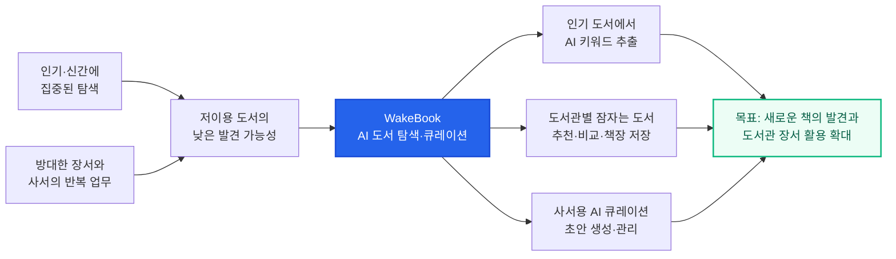
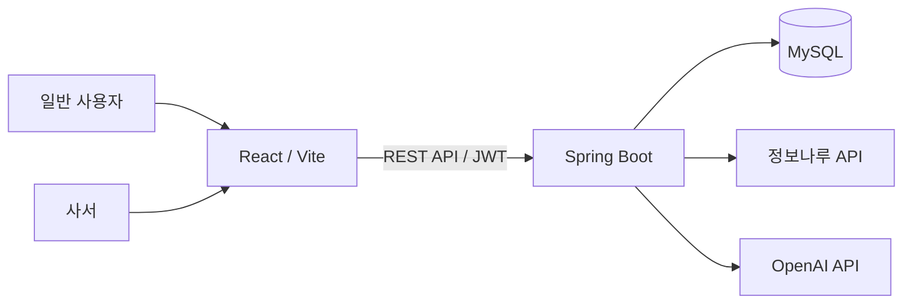
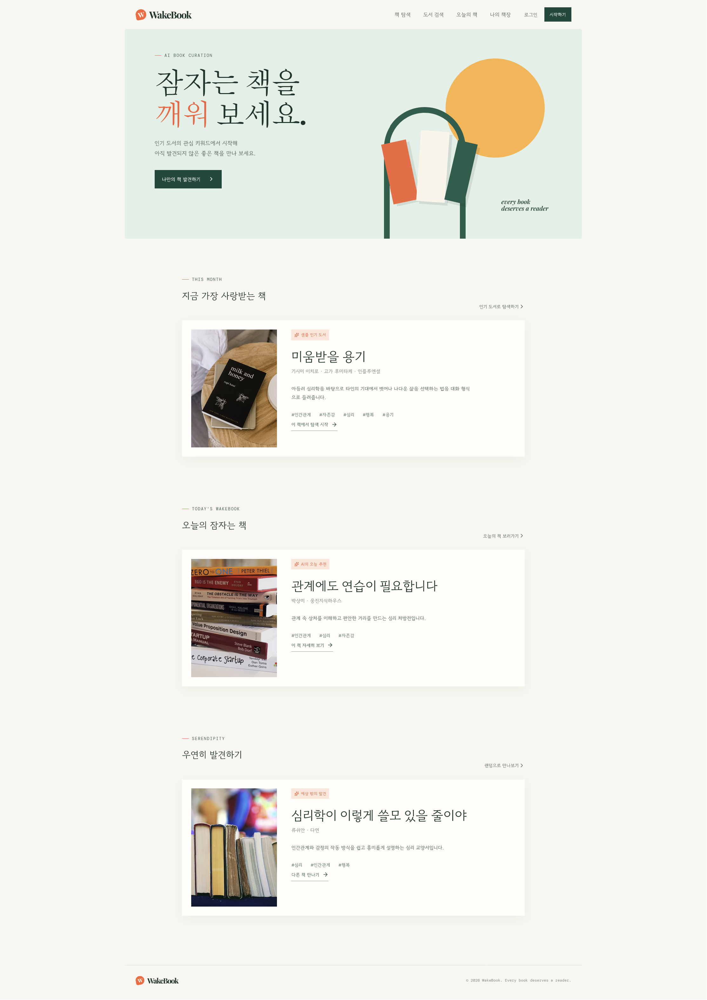
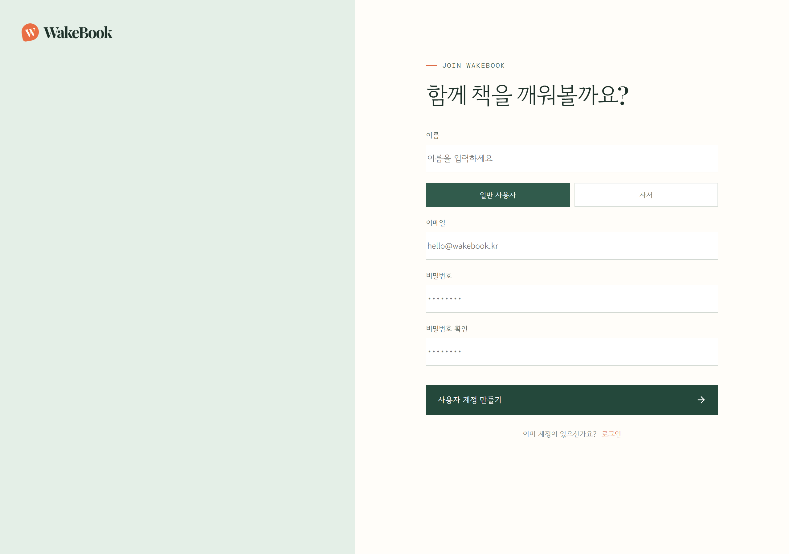
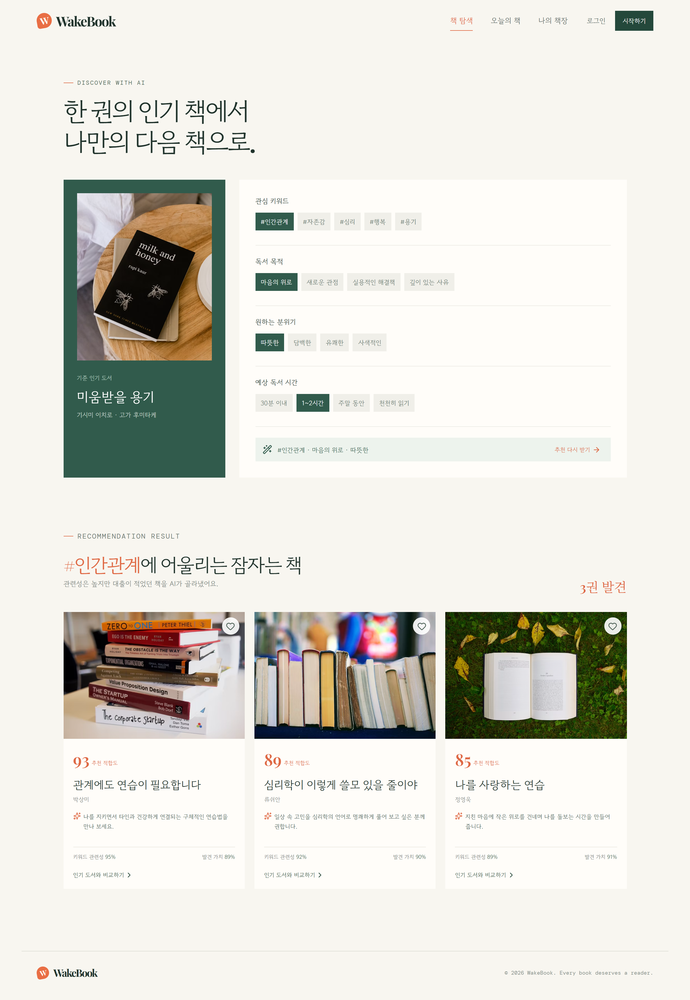
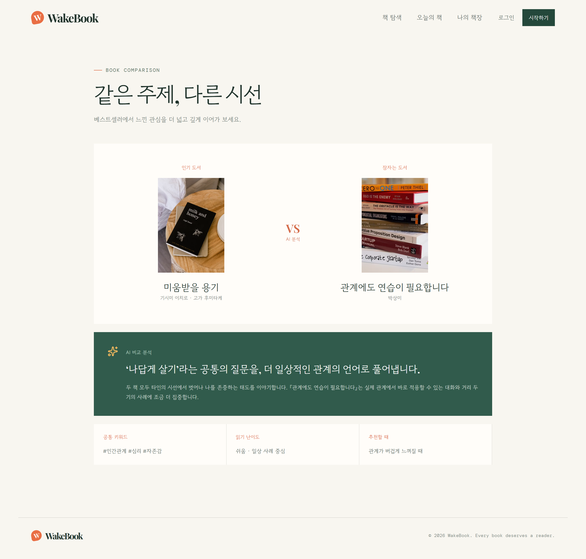
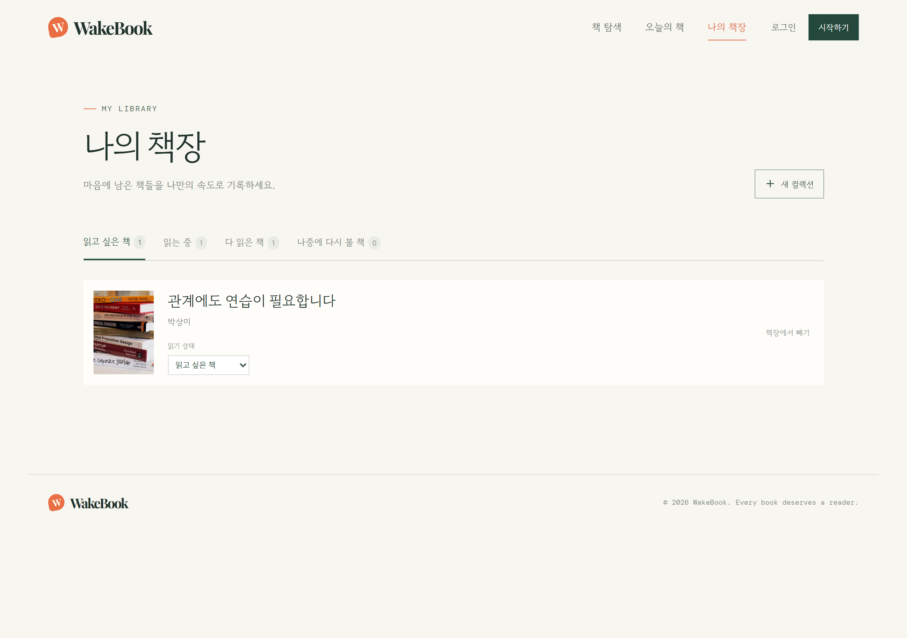
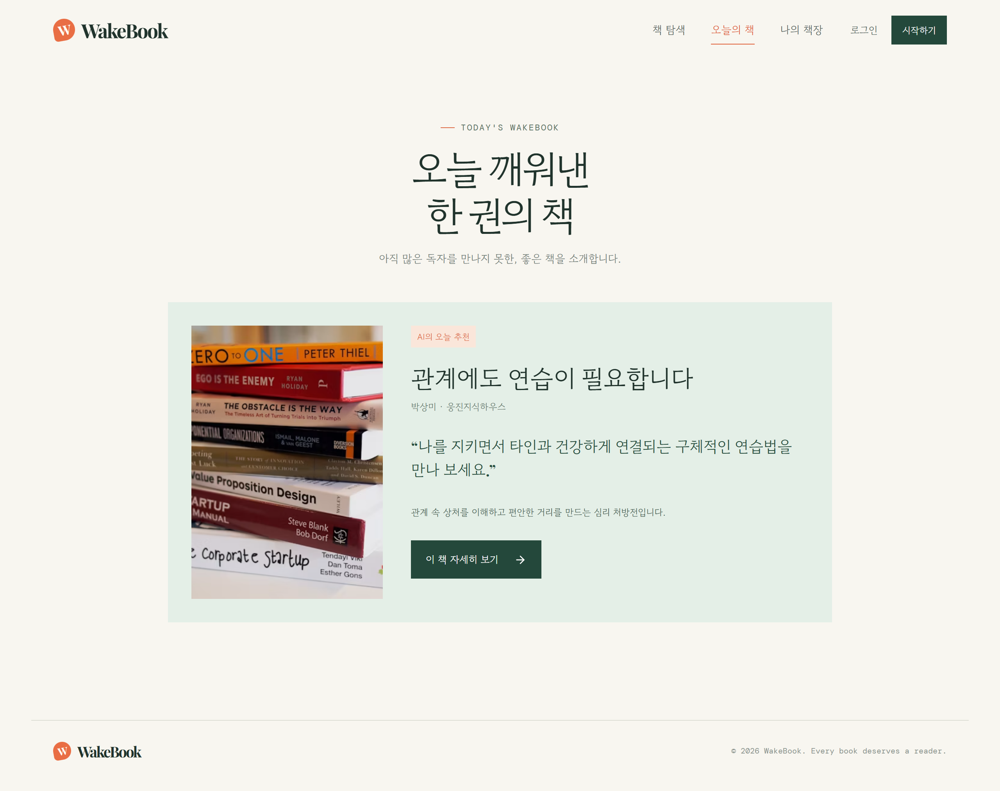
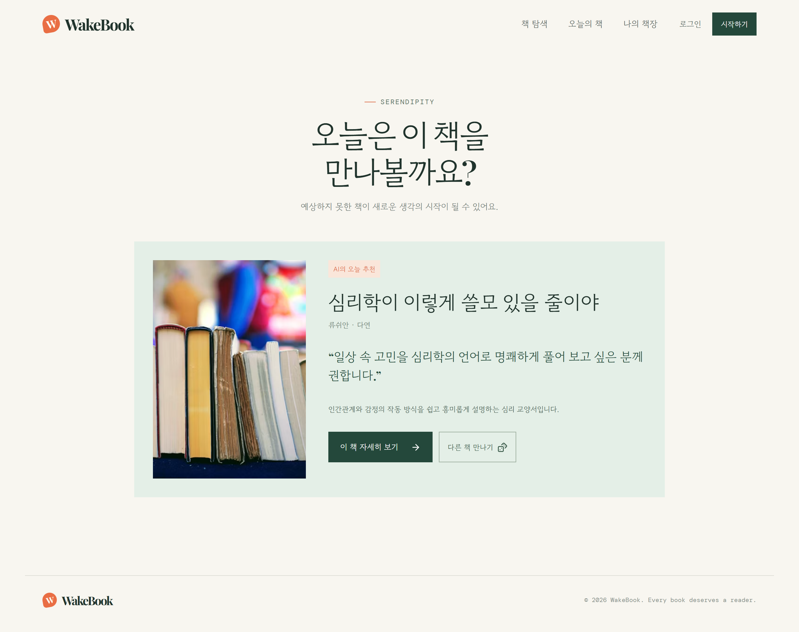
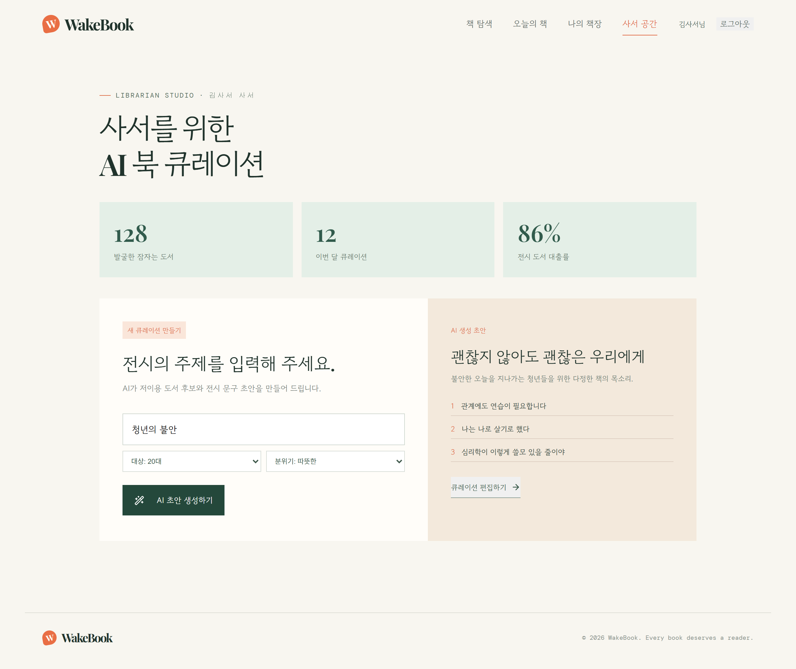

# WakeBook 중간보고서

> 작성일: 2026.07.30 
> 팀명: AIdios
> 프로젝트 저장소:  https://github.com/2026-PNU-AI-StudyGroup/2026-pnuai-studygroup-03

## 1. 프로젝트 결정 배경

WakeBook은 단일 목적의 과제가 아니라, 두 가지 목표를 함께 달성하기 위한 실습 프로젝트로 기획되었습니다.

첫째, 2026.08.20부터 진행되는 **데이터·AI 크리에이터 캠프**를 앞두고 팀원들이 캠프에서 요구되는 핵심 역량 — 공공데이터·외부 API 연동, AI(LLM) 기반 서비스 로직 설계, 프론트엔드·백엔드 통합 개발, 협업 기반 프로젝트 운영 — 을 실제 서비스 개발 전 과정을 통해 미리 체득하는 것을 목표로 합니다. 즉, 캠프 참가 전 실전 감각을 갖추기 위한 사전 훈련 프로젝트의 성격을 가집니다.

둘째, 이 역량 강화 과정에서 나오는 결과물이 일회성 연습으로 끝나지 않도록, 주제와 데이터 활용 방식을 **「2026 도서관 데이터 활용 공모전」**(공모부문: 데이터 활용 및 분석 기반 서비스 아이디어 제안 — 도서관의 새로운 역할에 맞는 신규 서비스·현안 해결 모델 제안)의 요건에 맞추어 설계하였습니다. 이를 통해 캠프 대비 학습과 공모전 출품이라는 두 가지 성과를 하나의 프로젝트로 동시에 확보하는 것을 목표로 하였습니다.

## 2. 팀 소개

### 2.1 팀명 및 방향

> **팀명:** AIdios  
> **소속:** 2026 PNU AI StudyGroup  
> **팀 구성:** 예은, 태윤, 인호, 주성

AIdios는 AI·데이터 분석·웹 개발 경험을 가진 4명의 구성원이 모인 팀입니다. 각자가 수행한 공공데이터 분석, AI Agent, 추천 서비스, 프론트엔드 및 Spring Boot 프로젝트 경험을 바탕으로, 데이터를 분석하는 데서 그치지 않고 사용자가 직접 활용할 수 있는 서비스로 구현하는 것을 목표로 합니다. WakeBook에서는 도서관 장서·대출 데이터에 AI 추천 기술을 결합해 저이용 도서의 가치를 다시 발견하고, 이용자와 사서 모두에게 실질적인 도움을 주는 서비스를 만들고 있습니다.

### 2.2 구성원별 역할

| 구성원 | 주요 역량 및 경험 | WakeBook 담당 역할 |
|---|---|---|
| **예은** | Python, C++, C#, Java / Google AI Professional Certificate / NVIDIA DLI 딥러닝의 기초 수료 / 응급실 대기 시간·병상 가용성 분석 및 AI Agent 프로젝트 경험 | AI 서비스 기획, 사용자 추천 시나리오 설계, AI 기능 및 프론트엔드 구현 지원 |
| **태윤** | C++ / 부산시장 득표율 예측, 공영주차장 인프라 불균형, 프로야구 성적·팬 이탈 분석 / 학습플러스 코칭 프로젝트 프론트엔드 경험 | 프론트엔드 UI·UX 구현, 추천 결과와 도서 데이터 시각화, 사용자 흐름 개선 |
| **인호** | Python / NVIDIA DLI 수료 / AI Agent를 활용한 투자 논리 검증 프로젝트 및 AI Agent PBL 우수상 | AI 추천 로직과 프롬프트 설계, 추천 결과 검증, 데이터 분석 및 품질 개선 |
| **주성** | Python, Java, Spring Boot, C++ / PCCP Lv.1 / 공공데이터 분석 및 PNU SW×X 문제해결 경진대회 우수상 | Spring Boot 백엔드, 인증·데이터베이스 설계, 정보나루·알라딘·OpenAI API 연동 |

### 2.3 팀의 강점

- **AI·데이터·웹을 아우르는 기술 구성:** 데이터 분석과 AI 기능 설계부터 프론트엔드·백엔드 구현까지 서비스 개발 전 과정을 팀 내부에서 수행할 수 있습니다.
- **공공데이터 활용 경험:** 의료, 선거, 교통, 스포츠, 소득·에너지 등 다양한 공공데이터 프로젝트 경험을 도서관 데이터 분석과 서비스 설계에 확장했습니다.
- **아이디어를 실제 서비스로 구현하는 실행력:** 분석 결과를 보고서에만 남기지 않고 추천, 비교, 책장, 사서 큐레이션 기능을 갖춘 웹 서비스로 구체화했습니다.

## 3. 프로젝트 소개

> **프로젝트명:** WakeBook  
> **슬로건:** 인기 책에서 시작해, 잠자는 책을 깨우다  
> **한 줄 소개:** 인기 도서의 관심 키워드와 이용자의 독서 조건을 바탕으로, 아직 충분히 발견되지 못한 도서를 연결하는 AI 기반 도서 탐색·큐레이션 서비스

### 3.1 개발 배경 및 필요성

#### 개발 배경

1. **인기 도서 중심의 탐색**
   - 공공도서관은 다양한 장서를 보유하고 있지만 이용자의 관심과 대출은 베스트셀러와 신간에 집중되기 쉽습니다.
   - 그 결과 주제 관련성과 정보 품질이 높아도 이용률이 낮아 독자와 만나지 못하는 ‘잠자는 도서’가 발생합니다.
2. **새로운 도서를 발견하기 어려운 추천 방식**
   - 이용자가 정확한 제목이나 저자를 모르면 방대한 장서에서 다음 책을 찾기 어렵습니다.
   - 익숙한 도서와 비슷한 책만 제안하는 방식에서 벗어나, 현재 관심사를 새로운 도서로 확장하는 탐색 경험이 필요합니다.
3. **저이용 장서를 활용해야 하는 사서의 업무 부담**
   - 사서는 도서관별 장서와 대출 데이터를 검토해 전시 후보를 찾고 소개 문구를 작성해야 합니다.
   - 후보 도서 발굴과 큐레이션 초안 작성을 지원해 반복 업무를 줄일 도구가 필요합니다.

#### 필요성

WakeBook은 이용자에게 익숙한 **인기 도서**를 탐색의 출발점으로 제시하고, AI가 추출한 핵심 키워드에 독서 목적·분위기·예상 독서 시간을 결합합니다. 이를 도서관별 장서 대출목록에서 선별한 잠자는 도서 후보군과 연결해 추천 근거를 설명하고, 사서에게는 저이용 장서를 활용한 전시형 큐레이션 제작 기능을 제공합니다.

#### 관련 사례의 한계와 WakeBook의 보완

최근 도서관들도 미대출 도서를 전시하거나 AI 추천 서비스를 도입하며 장서 활용 문제를 해결하려 하고 있습니다.

| 관련 사례 | 사례의 의미 | 공개된 운영 방식에서 확인되는 한계 | WakeBook의 보완 방식 |
|---|---|---|---|
| 용인시 도서관 ‘히든북스’ (2026) | 18개 도서관에서 전년도 대출 0회 도서 3,549권을 전시하고 특별대출 시행 | 한 달 동안 지정된 서가를 방문해야 하는 전시형 행사로, 이용자의 관심사와 도서를 연결하는 개인화 기능은 확인되지 않음 | 웹에서 인기 도서의 키워드와 독서 목적·분위기·시간을 결합해 도서관별 잠자는 도서를 상시 추천 |
| 인천 연수구 ‘잠자는 책을 깨워라’ (2024) | 7개 구립도서관이 미대출 도서를 전시하고 대출 참여자에게 기념품 제공 | 행사 기간과 보상에 의존해 미대출 도서를 노출하므로 지속적인 탐색 경험으로 이어지기 어려움 | 별도 행사 없이 인기 도서에서 AI 키워드 탐색으로 이어지는 반복 가능한 발견 흐름 제공 |
| 대출 횟수 0회 도서 사례 (2025) | 남산도서관 62,480권, 다대도서관 64,970권의 대출 0회 도서 현황과 일부 도서를 소개 | 문제와 개별 도서를 알리는 기사로, 각 도서관 데이터를 지속적으로 갱신하고 추천하는 체계는 제공하지 않음 | 사서가 장서 대출목록 CSV를 등록하면 도서관 코드별 저이용·고품질 후보군을 다시 산출하고 추천에 활용 |
| 국립중앙도서관 ‘AI실감서재’ (2025) | AI 사서를 통한 개인 맞춤형 추천과 스마트 책장 탐색 제공 | 공개 안내상 특정 물리 공간을 방문하는 체험형 서비스이며, 저이용 장서 발굴과 사서 큐레이션 관리는 명시되지 않음 | 저이용 장서에 초점을 맞춘 추천 이유·발견 가치 제공과 사서용 큐레이션 생성·저장·수정·삭제 기능을 하나의 웹 서비스로 통합 |

기존 사례가 **미대출 도서 전시**, **대출 참여 유도**, **AI 개인화 추천**을 각각 제공했다면, WakeBook은 이를 **도서관별 데이터 기반 후보 선정 → 이용자 맞춤 추천과 근거 제시 → 사서 큐레이션 관리**의 하나의 지속적인 서비스 구조로 설계했습니다. 또한 도서관별 후보 산출·추천·큐레이션 관리 백엔드 기능을 구현해 기존 방식의 한계를 보완했습니다.

### 3.2 개발 목표

| 목표 | 구현 방향 | 기대 효과 |
|---|---|---|
| 탐색 진입 장벽 완화 | 월간 인기 도서를 출발점으로 AI 핵심 키워드 제시 | 제목을 정확히 몰라도 관심 주제에서 탐색 시작 |
| 잠자는 도서 발굴 | 키워드·독서 목적·분위기·시간과 도서관별 저이용 도서 후보를 결합 | 이용자의 선택지와 독서 다양성 확대 |
| 설명 가능한 추천 | 추천 적합도, 키워드 관련성, 발견 가치와 AI 추천 이유 제공 | 추천 결과에 대한 이해와 신뢰 향상 |
| 역할별 기능 제공 | 일반 사용자용 탐색·비교·책장과 사서용 대시보드·큐레이션 분리 | 이용자 경험과 사서 업무를 함께 지원 |
| 장서 활용 확대 | 저이용 도서를 전시·추천·오늘의 책으로 다시 노출 | 도서관 장서 홍보 및 활용 기회 확대 |

### 3.3 주요 내용

1. **인기 도서 기반 탐색:** 도서관 정보나루의 인기 도서에서 관심 도서를 선택하고 AI가 제안한 핵심 키워드로 탐색을 시작합니다.
2. **맞춤형 잠자는 도서 추천:** 이용자가 선택한 키워드·독서 목적·분위기·예상 독서 시간을 반영해 해당 도서관의 잠자는 도서를 추천하고 추천 이유를 제공합니다.
3. **비교와 책장 관리:** 기준 인기 도서와 추천 도서의 공통점·차이점을 비교하고, 읽고 싶은 책을 개인 책장에 상태별로 저장합니다.
4. **오늘의 책과 우연한 발견:** 저이용·고품질 도서를 매일 한 권 소개하거나 무작위 탐색으로 예상 밖의 도서 발견을 돕습니다.
5. **사서 전용 AI 큐레이션:** 사서가 도서관별 장서 대출목록을 등록하면 잠자는 도서 후보군을 구성하고, 전시 주제에 맞는 후보 도서와 제목·소개 문구 초안을 생성·관리합니다.

## 4. 개발 진행 현황

### 4.1 완료 기능

| 구분 | 기능 | 상태 | 비고 |
|---|---|:---:|---|
| 프론트엔드 | 역할별 회원가입·로그인 UI | 완료 | 사용자/사서 화면 분리 |
| 프론트엔드 | 인기 도서·추천·비교 화면 | 완료 | API 연동 진행 중 |
| 프론트엔드 | 나의 책장·사서 큐레이션 UI | 완료 | API 연동 진행 중 |
| 백엔드 | JWT 인증 및 회원 관리 | 완료 | USER / LIBRARIAN 권한 |
| 백엔드 | 도서 검색·인기 도서 조회 | 완료 | 정보나루 API 연동 |
| 백엔드 | AI 키워드·추천·비교 | 완료 | OpenAI 연동 구조 |
| 백엔드 | 책장·사서 큐레이션 API | 완료 | DB 마이그레이션 포함 |

## 5. 시스템 구성

## 6. 설치 및 사용방법(핵심 기능)

### 6.1 설치

현재 정식 배포 환경은 없습니다. 프론트엔드-백엔드 API 연동 작업이 진행 중이라, 로컬 개발 환경(React/Vite 프론트엔드 + Spring Boot 백엔드)에서 직접 실행해 확인하는 단계이며, 정식 배포는 연동 완료 후 진행할 예정입니다.

### 6.1 일반 사용자

1. 인기 도서를 선택합니다.
2. AI 키워드와 독서 목적·분위기·독서 시간을 고릅니다.
3. 조건에 맞는 잠자는 도서와 추천 이유를 확인합니다.
4. 인기 도서와 추천 도서를 비교하거나 나의 책장에 저장합니다.

### 6.2 사용 시나리오

**일반 사용자**

<<<<<<< Updated upstream
1. 회원가입·로그인 후 인기 도서 목록에서 분야·연령대 등으로 관심 있는 책 한 권을 선택하면, AI가 그 책의 핵심 키워드(예: "인간관계", "자존감", "심리")를 뽑아줍니다.
2. 그중 관심 있는 키워드와 원하는 독서 목적("마음의 위로" 등), 분위기("따뜻한" 등)를 고르면, 소속 도서관에 잠들어 있던 책 중 조건에 맞는 추천 도서와 추천 이유·적합도 점수를 받습니다.
3. 추천받은 책을 원래 인기 도서와 비교해보면 공통 키워드와 차이점(난이도, 서술 방식 등)을 확인할 수 있습니다.
4. 마음에 드는 책은 "나의 책장"에 상태(읽고 싶음/읽는 중/완료/다시 읽기)와 함께 저장합니다.
5. 홈에서 "오늘의 잠자는 책"을 매일 한 권씩 추천받거나, "우연히 발견하기"로 즉흥적인 추천을 받아볼 수도 있습니다.

**사서**

1. 사서로 회원가입(소속 도서관 코드 입력) 후 로그인합니다.
2. 도서관정보나루에서 받은 우리 도서관 장서 대출목록 CSV를 업로드하면, 저이용·고품질 도서 후보군이 자동으로 추려집니다.
3. 사서 대시보드에서 후보 도서 수, 인기 키워드, 최근 만든 큐레이션 현황을 한눈에 확인합니다.
4. 전시 주제(예: "청년의 불안")와 대상 연령·분위기를 입력하면, AI가 제목·소개문·해시태그와 함께 큐레이션 도서 목록(추천 이유 포함) 초안을 만들어줍니다.
5. 초안이 마음에 들면 공개 여부를 정해 저장하고, 이후 목록에서 언제든 수정·삭제할 수 있습니다.

## 7. 기술 스택
=======
###  화면 와이어프레임

#### 서비스 시작 및 회원가입

  
  

그림 1. WakeBook 홈 화면 · 그림 2. 사용자 및 사서 역할 선택 회원가입 화면

#### 사용자 도서 탐색 흐름

  
  
  

그림 3. AI 키워드 기반 도서 탐색 · 그림 4. 인기 도서와 잠자는 도서 비교 · 그림 5. 나의 책장

#### 새로운 도서 발견 및 사서 큐레이션

  
  
  

그림 6. 오늘의 잠자는 책 · 그림 7. 우연히 발견하기 · 그림 8. 사서용 AI 북큐레이션 화면

## 5. 기술 스택

| 영역 | 기술 |
|---|---|
| Frontend | React, Vite, React Router, Axios |
| Backend | Java 21, Spring Boot, Spring Security, JPA |
| Database | MySQL, Flyway |
| AI | OpenAI API |
| 외부 데이터 | 도서관 정보나루 API, 알라딘 API |

## 8. 향후 계획

### 8.1 보완할 점
다른 도서관 내용을 건드리지 못하도록 해당 도서관 사서 검증 프로세스 필요.

### 8.2 차별화 아이디어 (구상 단계)

MVP 이후 이용자 페이지의 차별성을 강화하기 위해 검토 중인 아이디어입니다.

- [ ] **일 단위 트렌드 반영 추천**: 기존 서비스들의 "이주의 책"·"이달의 책"보다 짧은 주기로, 그날그날의 인기 검색어·트렌드를 반영해 잠자는 도서를 추천. 사서가 매일 수작업으로 트렌드를 찾아 도서를 매칭하기는 현실적으로 어려워, AI로 자동화해 차별점으로 삼으려는 아이디어.
- [ ] **트렌드 연계 추천 문구 자동 생성**: 그날의 인기 키워드(예: "환율 급등")의 맥락을 설명하는 문구와, 그 키워드에 맞는 개별 도서 추천 문구(예: "격동하는 환율, 어떻게 살아남아야 할까?")를 AI가 각각 생성.
- [ ] **독서 이력 기반 도전과제(뱃지) 시스템**: 사용자가 읽은 책의 KDC 분류를 분석해 분야별 독서량에 따라 단계적 도전과제 부여(예: 서양철학(160) 1권 완독 시 "서양철학 입문자", 10권 완독 시 "서양 철학가 [닉네임] 탄생"). 게임의 도전과제 시스템에서 착안한 동기부여 장치.
- [ ] **독서 여정 시각화(플로우차트) 기능**: 위 도전과제 시스템과 연계해, 사용자가 읽어온 책들의 분야·주제 확장 경로를 플로우차트 형태로 시각화. 화면 구성·상세 흐름은 추가 논의 후 구체화 예정.

## 9. 참고 자료

- 프로젝트 README
- API 명세서
