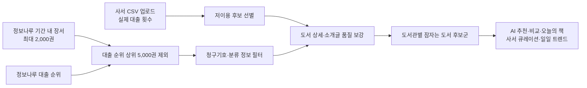
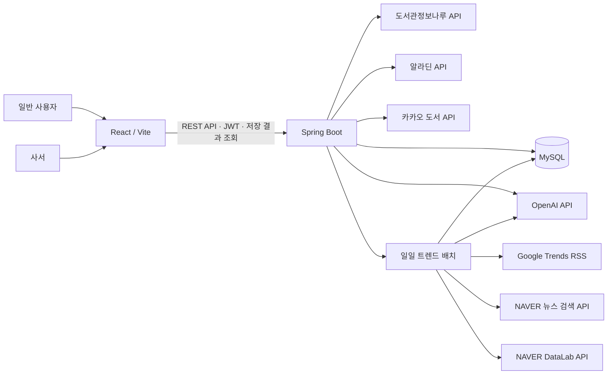
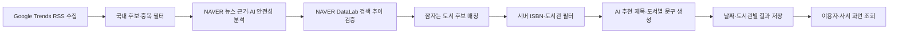

# WakeBook 최종보고서(초안)

> 작성일: 2026.08.24 
> 팀명: AIdios 
> 프로젝트명: WakeBook 
> 슬로건: 인기 책에서 시작해, 잠자는 책을 깨우다 
> 프로젝트 저장소: https://github.com/2026-PNU-AI-StudyGroup/2026-pnuai-studygroup-03

## 0. 목차

0. 목차 
1. 프로젝트 개요 
2. 기획 배경 및 문제 정의 
3. 핵심 설계: 잠자는 도서 후보군의 안정적 확보 
4. 구현 결과 
5. 차별성 및 기대 효과 
6. 구현 현황: 일 단위 트렌드 연계 추천 
7. 역할 분담 
8. 검증 및 향후 과제 
9. 결론

### 데이터·AI 크리에이터 캠프 참여 현황

중간보고서 작성 당시에는 2026년 8월 20일부터 진행되는 **데이터·AI 크리에이터 캠프** 참가를 목표로 WakeBook을 사전 실습 프로젝트로 운영하고 있었다. 이후 팀원들이 캠프에 참여하게 되었으며, 본 보고서 작성 시점 기준으로 캠프는 2026년 8월 20일부터 진행 중이다. WakeBook 개발 과정에서 축적한 공공데이터·외부 API 연동, AI 기반 서비스 로직 설계, 프론트엔드·백엔드 통합 개발 경험을 캠프 학습과 후속 프로젝트 수행에 지속적으로 활용하고 있다.

## 1. 프로젝트 개요

WakeBook은 공공도서관 장서 가운데 이용자의 관심을 충분히 받지 못한 ‘잠자는 도서’를 발굴하고, AI 기반 추천과 큐레이션으로 이용자에게 다시 연결하는 웹 서비스이다. 인기 도서를 탐색의 출발점으로 삼아 관심 키워드, 독서 목적, 분위기 등을 선택하게 하고, 해당 도서관의 저이용·고품질 도서를 추천한다. 사서에게는 후보 도서 발굴과 전시형 큐레이션 초안 작성을 지원한다.

| 구분 | 내용 |
|---|---|
| 해결하려는 문제 | 인기·신간 중심의 탐색으로 저이용 장서가 독자에게 발견되지 못하는 문제 |
| 핵심 사용자 | 새로운 책을 찾는 도서관 이용자, 장서 활용과 전시를 준비하는 사서 |
| 핵심 데이터 | 도서관정보나루 인기 도서·장서·대출 순위·도서 상세 정보, Google Trends RSS, NAVER 뉴스·검색 추이, 사서 제공 장서 대출목록 CSV |
| 핵심 기술 | React/Vite, Spring Boot/Java 21, MySQL/Flyway, OpenAI API |
| 핵심 가치 | 저이용 도서 발굴, 설명 가능한 AI 추천, 사서의 반복 큐레이션 업무 경감 |

## 2. 기획 배경 및 문제 정의

공공도서관은 폭넓은 장서를 보유하고 있지만, 대출과 이용자 관심은 베스트셀러·신간에 집중되기 쉽다. 이 과정에서 내용의 품질과 주제 적합성이 높아도 이용률이 낮아 독자와 연결되지 못하는 도서가 발생한다. 사서는 이러한 도서를 전시하거나 추천하려면 장서·대출 데이터를 확인하고 주제별 후보와 소개 문구를 직접 준비해야 하므로 지속적인 운영 부담이 크다.

기존의 미대출 도서 전시나 행사형 프로그램은 저이용 도서를 한시적으로 노출하는 데 의미가 있지만, 이용자의 현재 관심사와 도서를 연결하는 개인화된 탐색 경험에는 한계가 있다. WakeBook은 인기 도서에서 출발한 AI 키워드 탐색을 통해 이용자의 관심을 파악하고, 그 결과를 도서관별 잠자는 도서 후보군과 연결하는 방식으로 이 한계를 보완하고자 했다.

## 3. 핵심 설계: 잠자는 도서 후보군의 안정적 확보

### 3.1 초기 방식과 한계

초기에는 사서가 도서관정보나루의 장서 대출목록 CSV를 업로드하면, 대출 횟수가 낮은 도서를 저이용 후보로 선별하는 방식으로 설계했다. 실제 대출 횟수를 사용하므로 정확도가 높다는 장점이 있었다.

그러나 CSV가 업로드되지 않은 도서관은 후보군 자체가 생성되지 않아, 이용자가 잠자는 도서를 추천받을 수 없다는 문제가 있었다. 사서의 수작업 업로드를 서비스 이용의 전제조건으로 두면 도서관별 서비스 확장성과 초기 체험성이 낮아진다.

### 3.2 개선 방식: 정보나루 API 기반 후보 산출

이 문제를 해결하기 위해 CSV 업로드 경로는 유지하되, 정보나루 API만으로도 도서관별 후보군을 생성하는 자동 수집 파이프라인을 구현했다.

1. 이용자가 도서관을 선택하면 설정된 조회 기간(기본 12개월)의 장서를 페이지당 50권씩 최대 40페이지, 최대 2,000권까지 조회하고 같은 기간의 대출 순위 정보를 함께 가져온다.
2. 대출 순위 상위 5,000권에 포함되지 않는 장서를 ‘대출 순위 밖 장서’로 선별한다.
3. 청구기호·분류 정보가 있는 도서만 남겨 서가 탐색에 필요한 기본 정보를 갖춘 후보군을 만든다.
4. 카카오, 알라딘, 정보나루 도서 상세 정보 폴백 체인으로 제목·저자·출판사·소개글 등 품질 정보를 보강한다.
5. 소개글과 서지 정보가 충분한 도서만 저이용·고품질 잠자는 도서 후보군으로 저장한다.

장서 수집은 후보가 설정된 저장 목표의 3배에 도달하거나 정보나루의 마지막 페이지에 도달하면 최대 2,000권을 모두 조회하기 전이라도 조기 종료한다. 따라서 API 기반 후보군은 도서관 전체 장서의 완전한 전수조사가 아니라 제한된 조회 범위에서 서비스 시작에 필요한 후보를 확보하는 방식이다.

이 방식에서 ‘대출 순위 밖’은 정확한 대출 횟수를 알 수 없는 상황에서 사용하는 간접 신호이다. 따라서 실제 대출 횟수가 포함된 CSV가 있는 경우에는 CSV 기반 후보군을 우선하며, API 기반 후보군은 사서 데이터가 없는 도서관에서도 서비스를 시작할 수 있게 하는 확장 경로로 활용한다.

### 3.3 API 기반 판정의 한계와 보완 전략

API 기반 후보군은 CSV가 없는 도서관에도 서비스를 제공하기 위한 확장 경로이지만, ‘대출 순위 상위 5,000권 밖’이라는 조건만으로 실제 저대출을 직접 증명하지는 않는다. WakeBook은 이 한계를 숨기지 않고, 데이터 품질에 따라 두 경로를 구분해 운영한다.

| 비교 항목 | CSV 기반 후보군 | 정보나루 API 기반 후보군 | WakeBook의 운영 원칙 |
|---|---|---|---|
| 저이용 판정 근거 | 도서별 실제 대출 횟수 | 대출 순위 상위 5,000권 밖 여부 | CSV가 있으면 실제 대출 횟수 기반 후보군을 우선 |
| 적용 가능 도서관 | 사서가 CSV를 업로드한 도서관 | 정보나루에서 장서·대출 순위를 제공하는 도서관 | CSV가 없는 도서관도 즉시 탐색 경로 제공 |
| 정확도 | 저이용 여부를 직접 판정할 수 있어 높음 | 저이용 가능성을 나타내는 간접 신호 | 추천 화면과 운영 문서에서 산출 근거를 함께 표시 |
| 주요 한계 | 사서 업로드가 선행되어야 함 | 기간·순위 범위·조회 장서 범위의 영향을 받음 | 후보 품질 필터와 사서 CSV 재산출로 보완 |

일반적인 저이용 도서 전시가 대출 0회 도서를 일괄 노출하는 데 집중한다면, WakeBook은 실제 대출 횟수 또는 대출 순위 밖이라는 데이터 근거를 바탕으로 후보군을 구성한 뒤, 이용자 관심사·도서 품질·도서관 소장 여부를 추가로 반영한다. 이로써 단순 노출이 아닌 탐색·추천·사서 운영까지 이어지는 구조를 지향한다.

### 3.4 비동기 처리와 안정성 보완

후보군 산출은 다수의 외부 API 호출을 포함하므로 HTTP 요청 안에서 완료하지 않고 비동기 Job으로 처리했다. 사용자는 작업 ID로 진행 상태를 확인하고, 완료 후 저장된 후보군을 바로 탐색할 수 있다.

또한 다음 안정성 정책을 적용했다.

- 작업 대기열이 포화되면 작업을 `FAILED`로 기록하고 재시도가 가능하도록 처리
- 도서관별 DB 잠금을 통해 동일 도서관의 중복 수집 작업과 후보군 덮어쓰기 방지
- 작업 상태 조회를 요청자에게만 허용
- 한국 시간 자정 기준으로 사용자별 일일 API 산출 횟수 제한
- API 호출 실패 시 후보 도서 한 권의 오류가 전체 수집 실패로 이어지지 않도록 예외 처리

## 4. 구현 결과

### 4.1 일반 이용자 기능

| 기능 | 구현 내용 |
|---|---|
| 인기 도서 탐색 | 정보나루 인기 도서를 기준 도서로 선택 |
| AI 키워드 탐색 | 기준 도서의 핵심 키워드를 생성하고 관심 키워드 선택 지원 |
| 잠자는 도서 추천 | 키워드·독서 목적·분위기를 반영해 도서관별 후보군 추천 |
| 추천 근거 제시 | 추천 적합도, 키워드 관련성, 발견 가치, AI 추천 이유 제공 |
| 도서 비교 | 인기 도서와 추천 도서의 공통점·차이점 설명 |
| 오늘의 책·우연한 발견 | 후보군에서 날짜 기반 또는 무작위로 도서를 노출 |
| 추천 도서 재탐색 | 추천받은 책을 새로운 기준 도서로 삼아 관련 도서를 다시 탐색 |
| 일일 트렌드 추천 | 당일의 검색 트렌드와 도서관별 잠자는 도서를 연결하고, 당일 결과가 없으면 최근 3일 이내의 성공 결과를 대체 표시 |
| 공개 큐레이션 | 공개 상태의 사서 큐레이션 목록과 상세를 로그인 없이 조회 |
| 나의 책장 | 읽고 싶은 책·읽는 중·완독 등 상태별 도서 저장 |
| 도서관 선택 | 이미 준비된 도서관을 선택하거나 원하는 지역 도서관의 후보군 생성 요청 |

### 4.2 사서 기능

| 기능 | 구현 내용 |
|---|---|
| 역할 기반 인증 | USER와 LIBRARIAN 역할을 JWT로 구분 |
| CSV 후보군 산출 | 소속 도서관의 장서 대출목록 CSV에서 실제 대출 횟수 기반 후보 선별 |
| 사서 대시보드 | 후보 도서·큐레이션 현황 확인 |
| AI 큐레이션 | 전시 주제·대상·분위기에 따라 제목·소개·해시태그·도서 목록 초안 생성 |
| 큐레이션 관리 | 생성한 큐레이션의 저장·수정·삭제·공개 상태 관리 |
| 트렌드 배치 관리 | 소속 도서관의 일일 트렌드 추천 생성·재생성과 배치 상태·실패 코드 조회 |

### 4.3 시스템 구성

### 4.4 구현 검증 결과

2026년 8월 24일 현재 소스 코드 기준으로 백엔드 자동 테스트와 프론트엔드 프로덕션 빌드를 실행했다. 이 검증은 구현된 로직의 회귀·컴파일 오류를 확인한 결과이며, 실제 외부 API의 응답 품질이나 사용자 만족도를 직접 측정한 결과와는 구분한다.

| 검증 항목 | 실행 방법 | 결과 | 확인 범위 |
|---|---|---|---|
| 백엔드 자동 테스트 | `./gradlew test` | 233개 실행, 실패 0·오류 0 | 추천·후보군 산출·권한·트렌드 배치 등 단위 및 H2 기반 통합 테스트 |
| 프론트엔드 빌드 | `npm run build` | 성공 | React 컴포넌트·라우팅·API 클라이언트의 프로덕션 번들 생성 |
| MySQL 동시성 테스트 | 전용 `_test` 데이터베이스 필요 | 별도 실행 필요 | 도서관별 잠금과 실제 MySQL 동시 요청 동작 |
| 실외부 연동 테스트 | API 키 및 전용 테스트 DB 필요 | 별도 실행 필요 | 정보나루·알라딘·카카오·NAVER·OpenAI 실제 응답 계약 |

실제 서비스 화면은 홈, 인기 도서 탐색, 추천·비교, 나의 책장, 사서 큐레이션, 일일 트렌드 추천 흐름으로 구성했다. 최종 제출 시에는 배포 환경에서 실행한 화면 캡처와 대표 API 응답을 부록으로 추가해 사용자 흐름을 시각적으로 보완할 예정이다. 현재 저장소의 이미지 자료는 설계 단계 와이어프레임이므로, 구현 검증 캡처와 혼동하지 않도록 본문 근거로 사용하지 않았다.

## 5. 차별성 및 기대 효과

WakeBook의 차별성은 저이용 장서를 단순 노출하는 데서 끝나지 않고, 인기 도서를 출발점으로 한 개인 탐색과 당일 검색 트렌드를 출발점으로 한 사회적 관심사 탐색을 함께 제공한다는 점에 있다. **후보 발굴 → 개인 관심사·일일 트렌드 기반 추천 → 추천 근거 제공 → 사서 큐레이션 운영**을 하나의 흐름으로 연결한다.

| 비교 관점 | 단순 미대출 도서 전시 | CSV 업로드 기반 후보 운영 | WakeBook |
|---|---|---|---|
| 후보 발굴 | 대출 0회 등 정적 기준으로 일괄 선별 | 실제 대출 횟수로 정밀 선별 가능 | CSV와 정보나루 API 경로를 함께 제공 |
| 이용자 진입점 | 지정 서가·행사 중심 | 사서 운영 시점에 좌우 | 인기 도서·개인 관심사·일일 트렌드에서 탐색 시작 |
| 추천 설명 | 도서 목록 또는 간단한 안내 | 사서가 별도로 작성 | AI가 키워드·비교·추천 이유·트렌드 연계 문구 생성 |
| 운영 확장성 | 행사 기간과 인력에 의존 | CSV 업로드 여부에 의존 | 비동기 후보 산출·저장 결과 조회·사서 재생성으로 운영 지원 |

| 대상 | 기대 효과 |
|---|---|
| 이용자 | 인기 도서와 당일의 사회적 관심사를 출발점으로 새로운 책을 발견 |
| 사서 | 후보 도서 탐색과 트렌드 기반 전시 문구 작성에 드는 반복 업무 감소 |
| 도서관 | 저이용 장서를 현재 관심사와 연결해 발견 가능성과 활용 기회 확대 |
| 서비스 운영 | CSV가 없는 도서관도 API 기반으로 후보군을 마련해 초기 이용 가능 |

## 6. 구현 현황: 일 단위 트렌드 연계 추천

기존의 ‘이주의 책’, ‘이달의 책’보다 짧은 주기로 그날의 사회적 관심사와 잠자는 도서를 연결하는 일 단위 트렌드 연계 추천의 기본 파이프라인을 구현했다. 서버 시작 시 당일 누락 결과를 생성하고, 이후 매일 한국 시간 05:00에 배치를 실행한다. 이용자 화면은 요청마다 AI를 호출하지 않고 날짜별로 저장된 결과를 조회하므로, 실시간 스트리밍이 아닌 일일 배치 방식이다.

### 6.1 구현 범위

- Google Trends RSS에서 국내 트렌드 후보를 수집
- NAVER 뉴스 근거와 검색 추이를 활용해 후보의 맥락과 상승 여부를 보완
- AI로 민감 주제를 제외하고 트렌드의 맥락·필수 개념·추천 문구를 생성
- 잠자는 도서 후보군에서 관련 도서를 선정하고 서버에서 후보 ISBN을 재검증
- 날짜·도서관별 결과를 저장하고 이용자 화면과 사서 관리 화면에서 조회
- 당일 결과가 없으면 최근 3일 이내의 성공 결과를 대체 표시

예를 들어 ‘환율 급등’이 주목받는 날에는 AI가 환율 변동의 맥락을 설명하고, 경제·금융 관련 잠자는 도서를 연결해 “격동하는 환율, 돈의 흐름을 읽는 법”과 같은 전시형 추천 문구를 제공한다.

### 6.2 구현된 처리 흐름

민감 사건·범죄·재난·루머처럼 가볍게 도서 추천과 연결하기 어려운 트렌드는 AI 적격성·신뢰도 검사를 통해 기본적으로 제외한다. AI는 서버가 전달한 도서 후보의 ISBN만 선택할 수 있고, 서버는 선택 결과를 다시 검증한다. 생성 결과를 하루 단위로 저장해 이용자 요청 시의 응답 안정성과 비용 효율을 확보했다.

다만 RSS 한 번의 응답 후보 수와 원문 품질이 제한적이고, 안전성·관련성·도서관 필터를 모두 통과한 도서가 없으면 추천 결과가 생성되지 않을 수 있다. 최근 성공 결과가 있으면 대체 표시하지만 최초 성공 결과도 없는 경우에는 화면에 표시할 추천이 없다. 따라서 현재 상태는 기본 파이프라인 구현 완료, 후보 품질·탈락 후보 보충·0건 복구 정책 보완 중으로 구분한다.

## 7. 역할 분담

| 구성원 | 담당 역할 |
|---|---|
| 이예은 | React/Vite 기반 화면, 사용자 추천 흐름, API 연동 |
| 안태윤 | UI·UX 구현, 추천 결과 시각화, 사용자 흐름 개선 |
| 최인호 | AI 추천·큐레이션 비즈니스 로직, API 검증, 데이터 처리 |
| 박주성 | Spring Boot API, 인증·DB 설계, 정보나루·알라딘·OpenAI 등 외부 API 연동 |

## 8. 검증 및 향후 과제

백엔드 단위 테스트와 프론트엔드 프로덕션 빌드를 통해 주요 변경 사항을 검증했다. 향후에는 실제 도서관·이용자 환경에서 추천 관련성, 추천 다양성, 추천 문구의 설명 가능성, 후보군 산출 소요 시간과 실패율을 측정할 필요가 있다.

추가 과제는 다음과 같다.

- 실제 사서·이용자 피드백을 통한 추천 품질 평가
- 사서 소속 도서관 확인 절차 및 권한 정책 고도화
- 후보군 갱신 주기와 외부 API 호출 한도의 운영 정책 정교화
- 트렌드 원문 불용어 필터, 탈락 후보 대체 수집, 이전 성공 결과가 없는 경우의 0건 복구 정책 고도화
- 클라우드 배포 및 사용자 테스트 환경 구축

## 9. 결론

WakeBook은 인기 도서를 출발점으로 이용자의 관심을 포착하고, 그 관심을 도서관의 저이용 장서와 연결하는 AI 기반 도서 탐색·큐레이션 서비스이다. 초기 CSV 의존 방식의 한계를 정보나루 API 기반 후보 산출 경로로 보완함으로써, 사서의 업로드가 없는 도서관에서도 잠자는 도서 추천을 시작할 수 있는 기반을 마련했다.

일 단위 트렌드 연계 추천의 기본 흐름을 구현함으로써 저이용 장서를 당일의 사회적 관심사와 새로운 독자에게 연결할 수 있는 가능성을 확장했다. 향후 후보 품질과 0건 복구 정책을 보완하면 트렌드 변화에도 안정적으로 추천을 제공하는 살아 있는 도서관 자원으로 발전시킬 수 있다.
